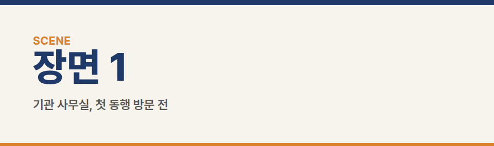
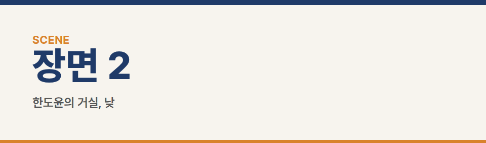
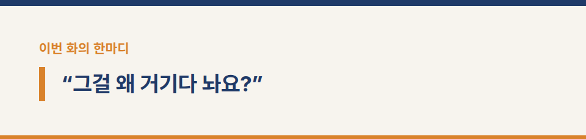
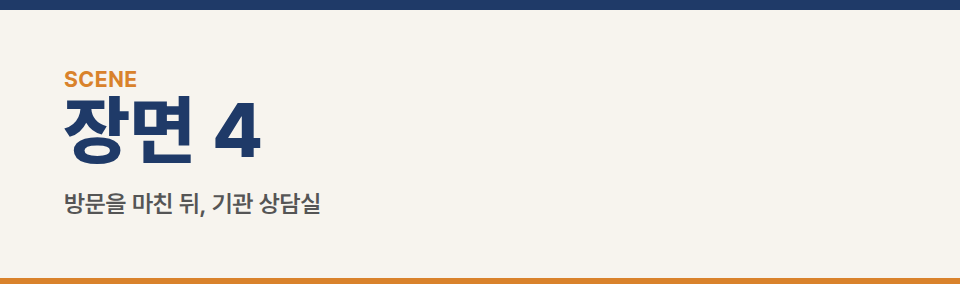
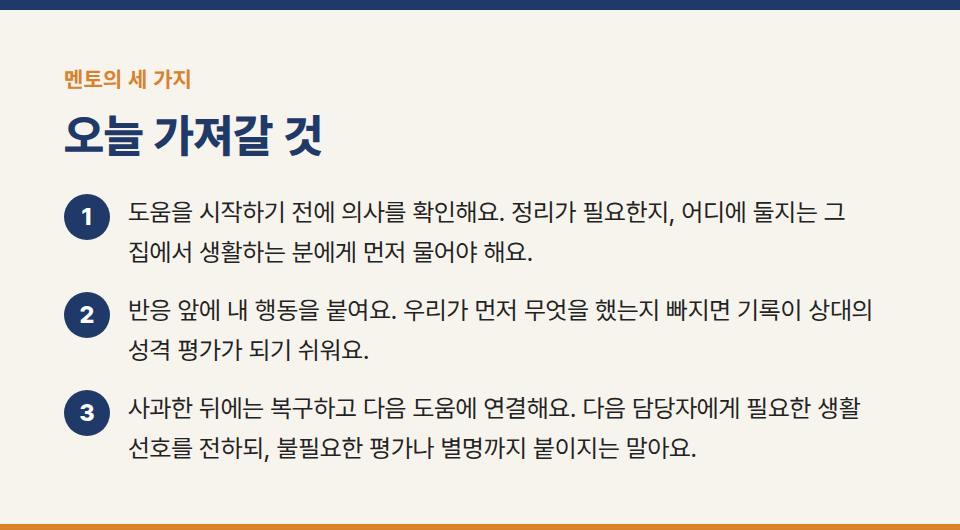
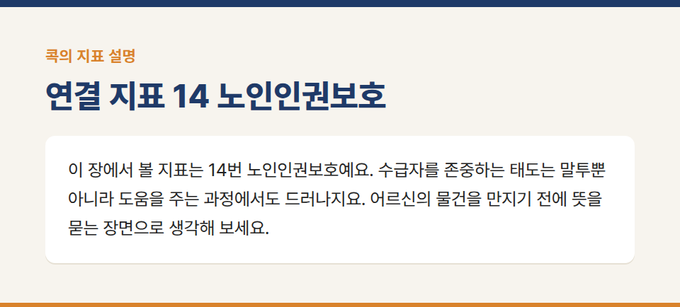
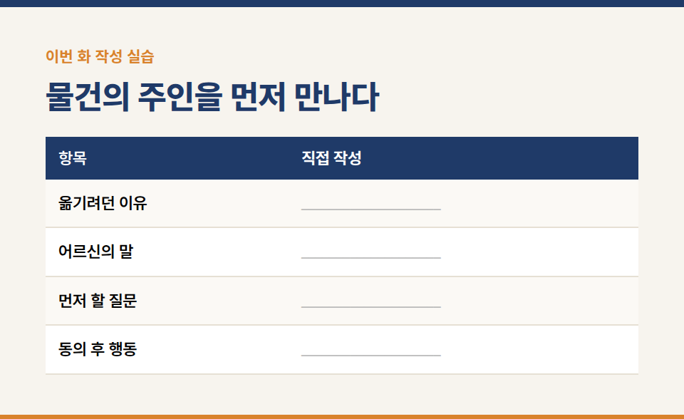
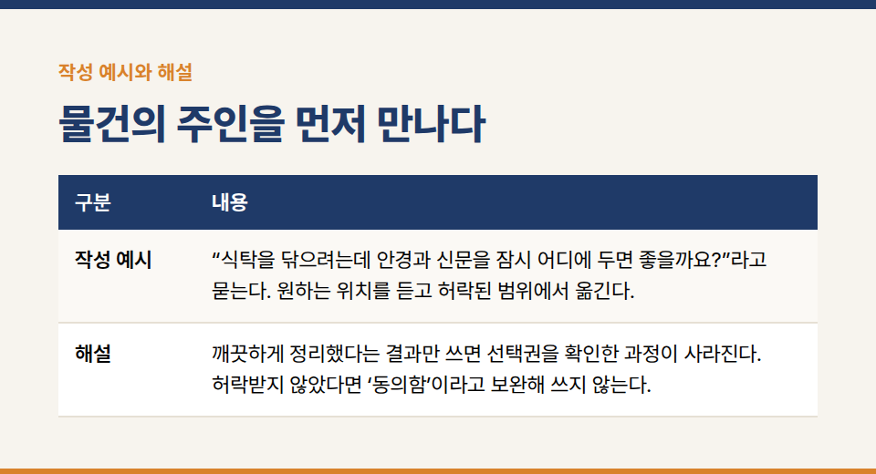

카테고리: 평가바이블365 연재
[평가바이블365 연재 1화] 그걸 왜 거기다 놔요

장기요양기관의 실무지침서 **『평가바이블365 [방문요양] 1. 행동편』** 연재 1/20화입니다.

※ 이야기에 등장하는 인물·기관·사건은 모두 가상입니다.

### 연결 지표 14 노인인권보호

## 장면 1 · 기관 사무실, 첫 동행 방문 전

지우는 가방 지퍼를 열었다 닫았다. 상담지, 펜 두 자루, 명찰. 모두 있었다. 세 번째로 확인할 때 수진이 차 열쇠를 집었다.

“빠뜨린 것 있어요?”

“아니요. 그냥 긴장돼서요.”

지우는 가방을 메며 웃었다.

“그래도 어르신들하고는 잘 지내는 편이에요. 봉사활동을 오래 했거든요.”

“그랬군요. 오늘은 한도윤 어르신이 어떻게 생활하시는지부터 봅시다.”

수진은 지우의 수첩을 들여다보지 않았다. 지우는 준비해 온 질문 순서를 머릿속으로 다시 읽었다. 인사, 불편한 점, 필요한 도움. 잘할 수 있을 것 같았다.

## 장면 2 · 한도윤의 거실, 낮

탁자에는 반쯤 접힌 신문과 안경집, 리모컨이 놓여 있었다. 물컵은 가장자리에 가까웠다. 지우는 상담지를 펼칠 자리를 찾았다. 신문을 조금만 접으면 될 것 같았다.

“제가 조금 정리해 드릴게요.”

말하면서 손이 먼저 움직였다. 안경집은 아래 선반으로, 신문은 반으로 접어 탁자 한쪽으로. 금세 빈자리가 생겼다. 지우는 그곳에 상담지를 올렸다.

“그걸 왜 거기다 놔요?”

어르신이 허리를 굽히려다 멈췄다. 지우도 멈췄다.

“안경집이요? 밑에 넣어 드렸어요.”

“밑에 있는 건 아는데, 내가 거기까지 손이 안 가잖아.”

지우는 아래 선반을 봤다. 서 있는 자신에게는 가까웠다. 의자에 앉아 탁자를 앞에 둔 어르신에게는 달랐다.

“그리고 그 신문, 거기 읽던 거야.”

접힌 면 사이에서 작은 종이가 미끄러져 나왔다. 날짜와 전화번호가 적혀 있었다. 지우는 종이를 집어 들었다가 어디에 끼워야 할지 몰라 그대로 들고 있었다.

수진은 옆 의자에 앉아 있었다. 지우 대신 물건을 정리하거나 말을 가로채지 않았다. 지우는 자신의 상담지가 놓인 빈자리를 내려다봤다. 어르신의 물건을 치우고 만든 자리였다.

## 장면 3 · 같은 거실, 잠시 뒤

“제가 먼저 여쭤봤어야 했는데, 죄송합니다. 안경집은 어디에 놓아드릴까요?”

“전화기 옆에. 뚜껑은 내 쪽으로.”

지우는 안경집을 내려놓고 손을 뗐다. 어르신이 직접 손을 뻗어 뚜껑을 열었다. 그제야 지우는 왜 그 자리에 있었는지 알았다.

“이 종이는 어디에 끼워 두셨나요?”

“거기 시장 소식 나오는 면. 다음 장.”

어르신이 신문을 넘겼다. 지우는 기다렸다. 종이가 제자리로 돌아갔다.

물컵은 아직 가장자리 가까이에 있었다. 이번에는 손을 대기 전에 물었다.

“컵이 끝에 가까운데, 조금 안쪽에 놓아도 될까요?”

“안경집 앞에는 말고. 이쪽이면 돼.”

어르신이 손끝으로 자리를 짚었다. 컵을 옮긴 뒤 지우는 상담지를 자기 무릎 위에 놓았다.

“이렇게 놓고 이야기 나눠도 괜찮겠습니다.”

“그건 편한 대로 해요.”

어르신의 말투가 풀렸다. 지우는 그 말을 ‘이제 무엇이든 해도 된다’는 허락으로 듣지 않으려고 했다.

## 장면 4 · 방문을 마친 뒤, 기관 상담실

지우는 기록 초안에 ‘물건 정리에 예민하심’이라고 썼다가 펜을 멈췄다.

“제가 옮긴 얘기를 빼니까, 어르신이 먼저 화내신 것처럼 보이네요.”

수진이 고개를 끄덕였다.

“오늘 있었던 일에서 세 가지만 가져갑시다.”

## 멘토의 세 가지

1. “도움을 시작하기 전에 의사를 확인해요. 정리가 필요한지, 어디에 둘지는 그 집에서 생활하는 분에게 먼저 물어야 해요.”
2. “반응 앞에 내 행동을 붙여요. 우리가 먼저 무엇을 했는지 빠지면 기록이 상대의 성격 평가가 되기 쉬워요.”
3. “사과한 뒤에는 복구하고 다음 도움에 연결해요. 다음 담당자에게 필요한 생활 선호를 전하되, 불필요한 평가나 별명까지 붙이지는 말아요.”

지우는 문장을 고쳤다.

‘직원이 사전 확인 없이 안경집 위치를 바꿈. 어르신은 꺼내기 어렵다고 말하며 전화기 옆에 놓기를 요청함. 직원은 사과하고 요청한 위치로 옮김.’

“좋은 마음으로 갔다는 건 기록에 쓸 데가 별로 없네요.”

“그 마음이 어떤 행동이 됐는지는 남길 수 있죠.”

지우는 다음 방문 준비 목록 맨 위에 한 줄을 썼다. ‘물건보다 먼저, 물어보기.’

## 콕의 마지막 한 지표 · 노인인권보호

콕이 자기 책상을 정리한다. 큰 수첩은 천장 가까운 선반에, 돋보기는 그 위에 올린다.

“아주 훌륭한 정리입니다!”

박수를 치다가 수첩을 꺼내려 한다. 손이 닿지 않는다. 작은 발판을 가져와도 모자란다. 결국 빈 책상 앞에 앉아 천장만 본다.

“일할 자리는 생겼는데 일을 못 하겠네.”

콕이 선반에 붙인 ‘깔끔함’ 표지를 떼어 ‘누가 사용하는가?’로 바꾼다.

“여기 하나만 콕! 이 장에서 볼 지표는 **14번 노인인권보호**예요. 수급자를 존중하는 태도는 말투뿐 아니라 도움을 주는 과정에서도 드러나지요. 어르신의 물건을 만지기 전에 뜻을 묻는 장면으로 생각해 보세요.”

**기준과 사례의 구분:** 사전 의사 확인은 이 책의 실천 예시다. 이 장면 하나로 지표 전체의 충족 여부나 점수를 확정하지 않는다. 공식 세부기준은 16장의 원문 대조 요약과 함께 확인한다.

**실습 연결:** 부록 실습 01. 본문에서 지우가 실제로 한 행동과, 앞으로 하기로 한 행동을 나누어 적는다.

## 이번 화 작성 실습 — 물건의 주인을 먼저 만나다

**상황:** 안경과 신문이 식탁 끝에 놓여 있다. 지우는 정리하려고 손을 뻗는다. 어르신은 “거기가 내가 찾는 자리야”라고 한다.

### 직접 작성

- 옮기려던 이유: ____________________
- 어르신의 말: ____________________
- 먼저 할 질문: ____________________
- 동의 후 행동: ____________________

**작성 예시:** “식탁을 닦으려는데 안경과 신문을 잠시 어디에 두면 좋을까요?”라고 묻는다. 원하는 위치를 듣고 허락된 범위에서 옮긴다.

**해설:** 깨끗하게 정리했다는 결과만 쓰면 선택권을 확인한 과정이 사라진다. 허락받지 않았다면 ‘동의함’이라고 보완해 쓰지 않는다.

**짝 토의:** 작성한 문장 중 직접 확인한 사실에 밑줄을 긋고, 앞으로 할 일에는 동그라미를 표시한다. 상대가 사실로 오해할 표현이 있는지 서로 확인한다.

※ 공식 평가기준은 국민건강보험공단의 최신 평가매뉴얼과 공지를 함께 확인해 주세요.

※ 장기요양기관 평가·청구 실무 문의: 동행솔루션 042-673-3338 / donghangsol@naver.com
