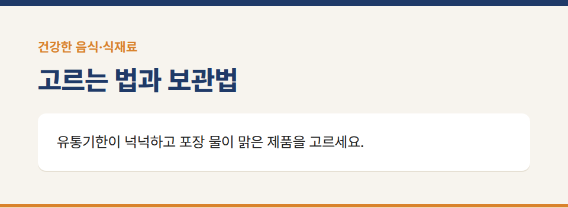
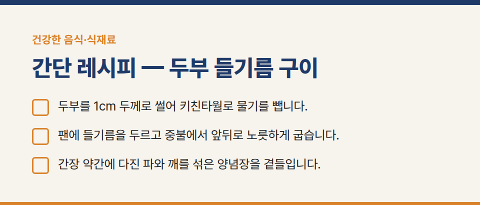
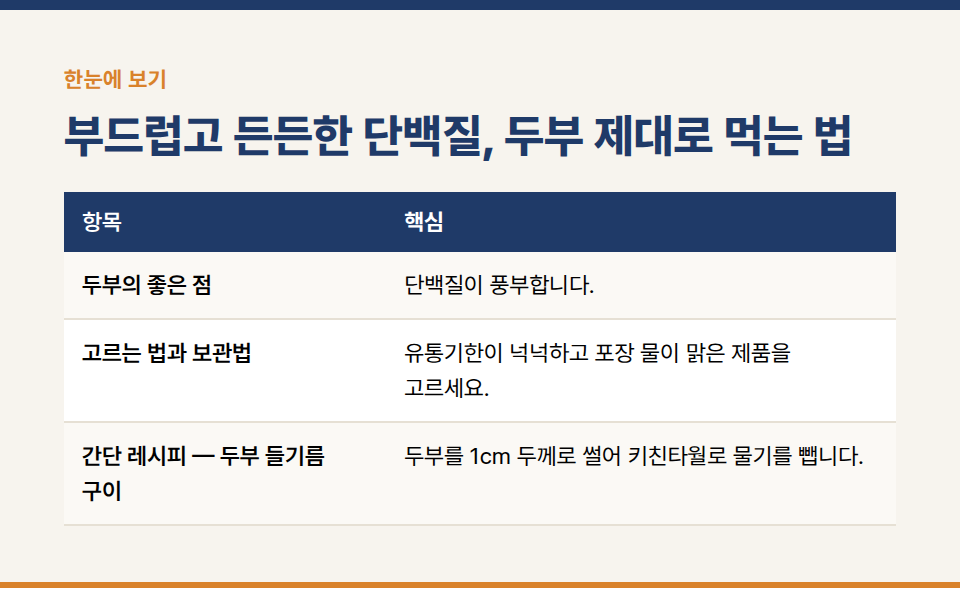
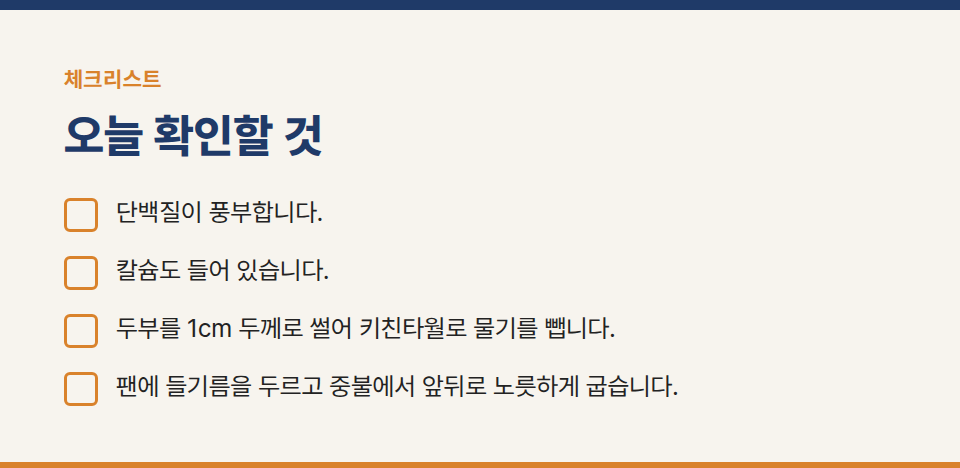

카테고리: 건강한 음식·식재료
부드럽고 든든한 단백질, 두부 제대로 먹는 법

두부는 콩으로 만든 대표적인 식물성 단백질 식품입니다. 부드러워서 씹고 삼키기 편하기 때문에 치아가 약한 어르신 식단에도 자주 오릅니다.

## 두부의 좋은 점

- 단백질이 풍부합니다. 나이가 들수록 근육량이 줄어들기 쉬워 매 끼니 단백질을 챙기는 것이 중요한데, 두부는 부담 없이 단백질을 더할 수 있는 식재료입니다.
- 칼슘도 들어 있습니다. 응고제로 간수(염화마그네슘)나 황산칼슘을 쓰는데, 제품에 따라 칼슘 함량이 다르니 영양성분표를 확인해 보세요.
- 조리법이 다양합니다. 찌개, 조림, 부침, 샐러드 어디에나 잘 어울립니다.

## 고르는 법과 보관법

유통기한이 넉넉하고 포장 물이 맑은 제품을 고르세요. 개봉 후 남은 두부는 밀폐 용기에 담고 깨끗한 물을 부어 냉장 보관하며, 물은 매일 갈아 주고 2~3일 안에 먹는 것이 좋습니다.

## 간단 레시피 — 두부 들기름 구이

1. 두부를 1cm 두께로 썰어 키친타월로 물기를 뺍니다.
2. 팬에 들기름을 두르고 중불에서 앞뒤로 노릇하게 굽습니다.
3. 간장 약간에 다진 파와 깨를 섞은 양념장을 곁들입니다.

짜게 먹지 않도록 양념장은 따로 내어 찍어 먹는 방식을 추천합니다.

※ 질환이 있거나 약을 복용 중이라면 식단을 바꾸기 전에 의사나 영양사와 상담해 주세요.
