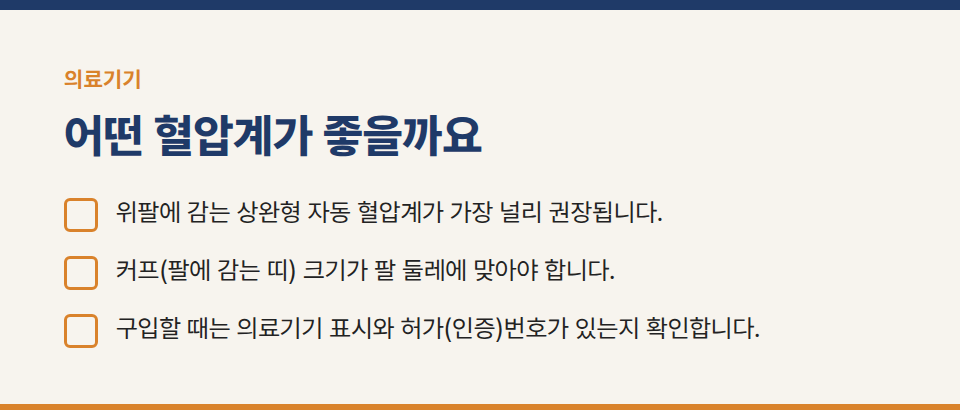
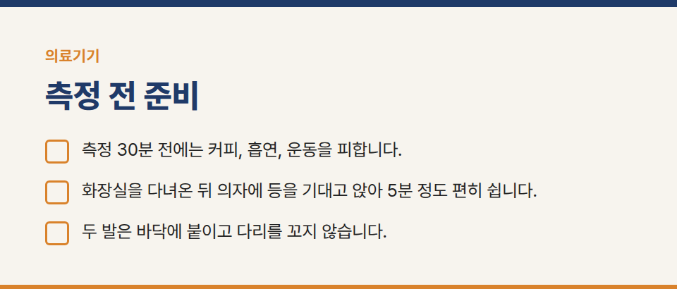
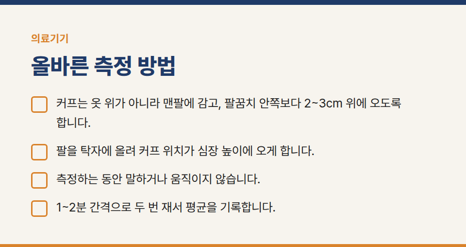
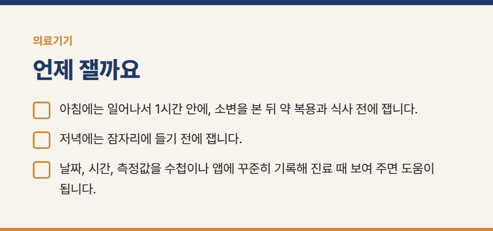
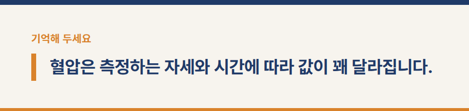
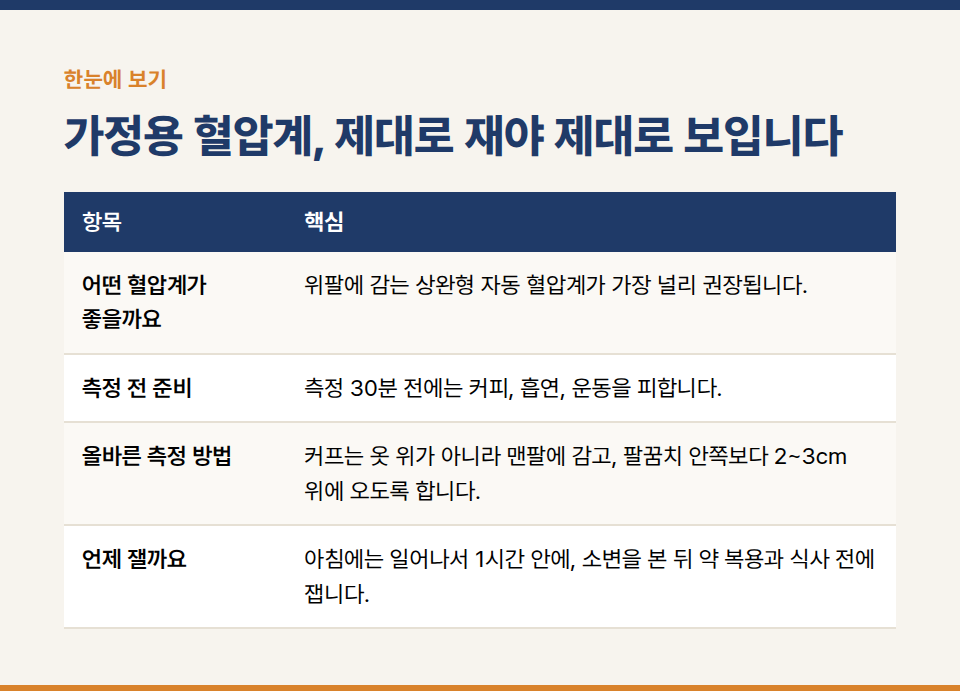

카테고리: 의료기기
가정용 혈압계, 제대로 재야 제대로 보입니다

혈압은 측정하는 자세와 시간에 따라 값이 꽤 달라집니다. 집에서 재는 혈압이 의미 있으려면 매번 같은 방법으로 재는 것이 가장 중요합니다.

## 어떤 혈압계가 좋을까요

- 위팔에 감는 상완형 자동 혈압계가 가장 널리 권장됩니다. 손목형은 손목 위치에 따라 오차가 생기기 쉽습니다.
- 커프(팔에 감는 띠) 크기가 팔 둘레에 맞아야 합니다. 팔이 굵거나 가는 분은 맞는 크기의 커프를 따로 확인하세요.
- 구입할 때는 의료기기 표시와 허가(인증)번호가 있는지 확인합니다.

## 측정 전 준비

- 측정 30분 전에는 커피, 흡연, 운동을 피합니다.
- 화장실을 다녀온 뒤 의자에 등을 기대고 앉아 5분 정도 편히 쉽니다.
- 두 발은 바닥에 붙이고 다리를 꼬지 않습니다.

## 올바른 측정 방법

- 커프는 옷 위가 아니라 맨팔에 감고, 팔꿈치 안쪽보다 2~3cm 위에 오도록 합니다.
- 팔을 탁자에 올려 커프 위치가 심장 높이에 오게 합니다.
- 측정하는 동안 말하거나 움직이지 않습니다.
- 1~2분 간격으로 두 번 재서 평균을 기록합니다.

## 언제 잴까요

- 아침에는 일어나서 1시간 안에, 소변을 본 뒤 약 복용과 식사 전에 잽니다.
- 저녁에는 잠자리에 들기 전에 잽니다.
- 날짜, 시간, 측정값을 수첩이나 앱에 꾸준히 기록해 진료 때 보여 주면 도움이 됩니다.

※ 이 글은 일반적인 사용 안내입니다. 제품별 사용법은 사용설명서를 따르고, 측정값이 평소와 다르거나 증상이 있으면 의료진과 상담해 주세요.
