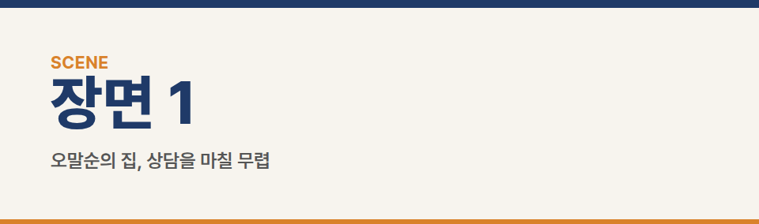
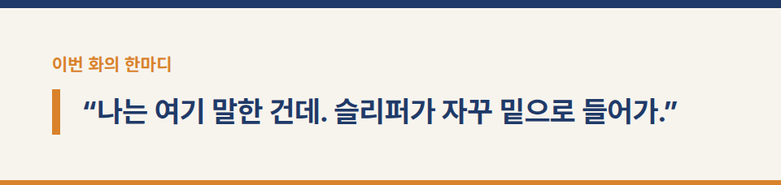
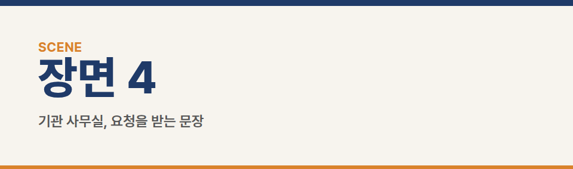
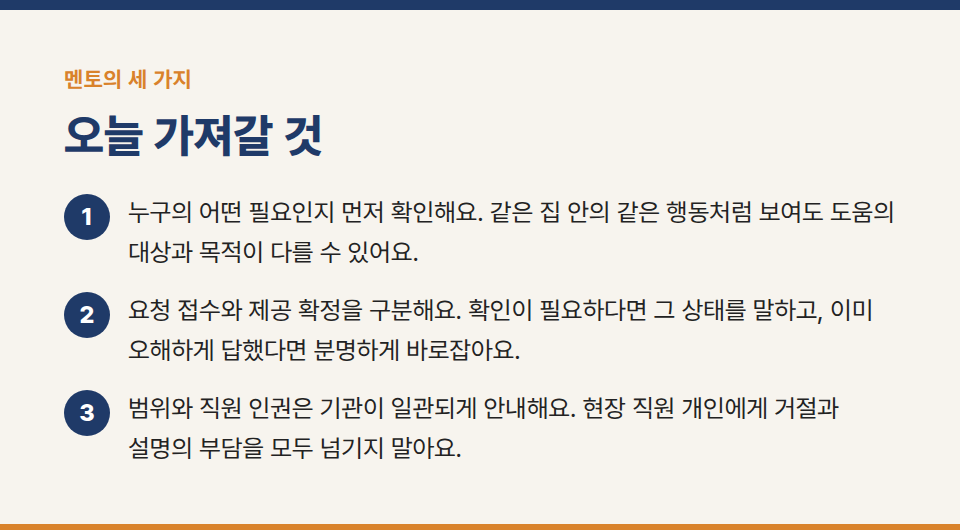
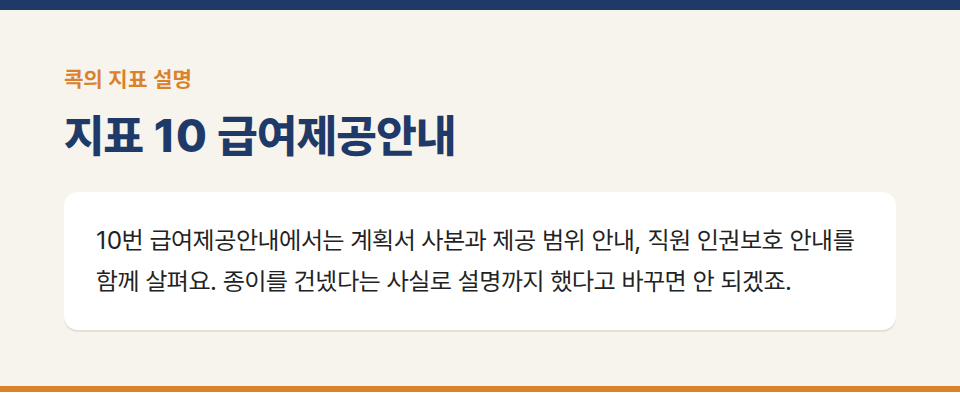
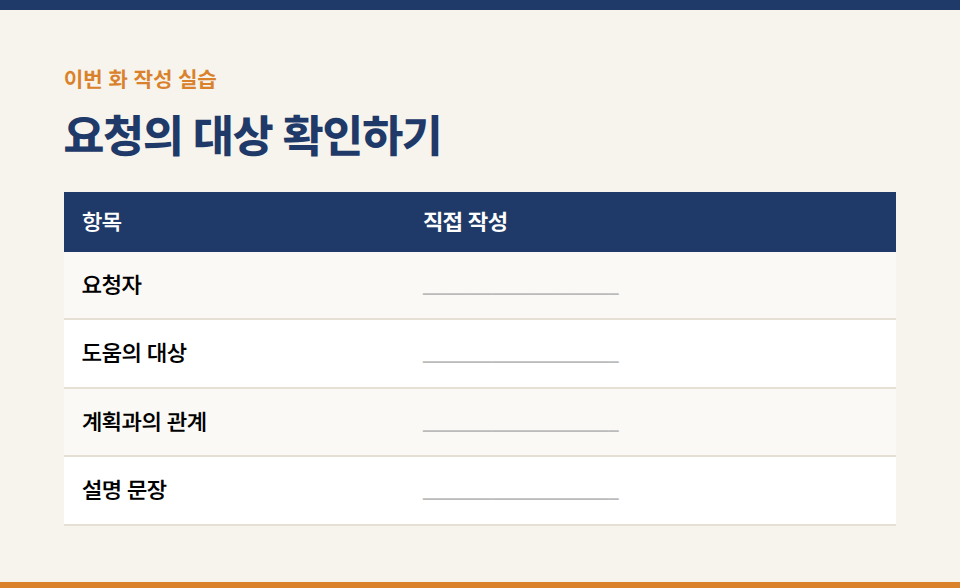
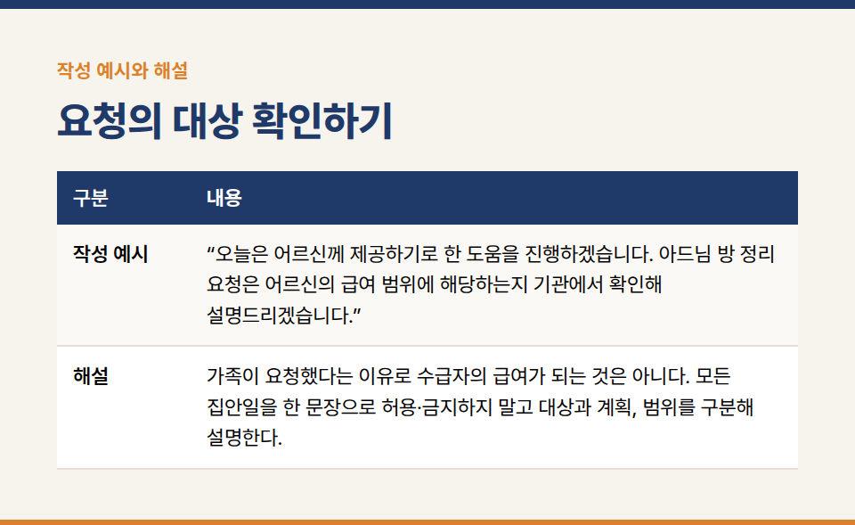

카테고리: 평가바이블365 연재
[평가바이블365 연재 9화] 이것도 해주시는 거 아니에요

장기요양기관의 실무지침서 **『평가바이블365 [방문요양] 1. 행동편』** 연재 9/20화입니다.

※ 이야기에 등장하는 인물·기관·사건은 모두 가상입니다.

### 지표 10 급여제공안내

## 장면 1 · 오말순의 집, 상담을 마칠 무렵

말순 어르신의 아들이 방문을 열며 말했다.

“오신 김에 청소도 조금 더 부탁드려도 되죠?”

지우는 상담지를 가방에 넣다 말고 고개를 들었다.

“네, 선생님께 전달하겠습니다.”

아들이 안도한 얼굴로 방을 가리켰다. 책상 위에 업무 서류가 쌓여 있고, 바닥에는 택배 상자가 놓여 있었다.

“제 방은 주말마다 하려는데 시간이 안 나네요. 여기부터 좀 해 주세요.”

지우의 손이 멈췄다. ‘전달하겠다’는 말을 아들은 ‘해주겠다’로 들었다. 지우도 범위를 묻기 전에 너무 쉽게 답했다.

“아, 제가 어떤 요청인지 먼저 확인했어야 했습니다.”

“방금 해주신다고 하셨잖아요.”

수진은 지우 옆에 있었다. 지우가 자신이 한 말을 정리할 시간을 주었다.

## 장면 2 · 침대 옆, 다른 부탁

말순 어르신이 손을 들었다.

“나는 여기 말한 건데. 슬리퍼가 자꾸 밑으로 들어가.”

침대 아래에 슬리퍼 한 짝이 보였다. 어르신은 숙여 꺼내기 어렵다고 했다. 침상 주변 정리는 오늘 제공 내용에 포함돼 있었다.

지우는 두 요청을 나눠 적었다. 수급자의 침상 주변 생활 불편과 아들의 개인 업무 공간 정리. 같은 집 안의 청소라는 이유로 한 가지 요청으로 묶을 수는 없었다.

“제가 전달하겠다는 말씀을 먼저 드려서 제공이 정해진 것처럼 들리셨겠습니다. 죄송합니다. 어떤 도움인지 확인하고 급여 범위에 맞게 안내드려야 합니다.”

아들이 팔짱을 풀었다.

“어머니 집이니까 다 되는 줄 알았죠.”

지우는 ‘가족이 무리하게 요구함’이라고 적지 않았다. 어떤 요청을 받았는지, 자신이 무엇이라고 답했는지부터 남겼다.

## 장면 3 · 거실 탁자, 범위 재안내

관리자인 수진이 현재 유효한 계획서 사본을 함께 확인했다. 이번 설명은 기존 안내를 보완하는 재안내이며 계약 시 필요한 안내를 나중에 했다는 사실로 바꾸는 장면은 아니다.

수진은 수급자에게 제공하기로 한 도움과 급여 범위, 급여 외 행위를 구분해 설명했다. 아들의 개인 업무 공간을 위한 요청을 수급자의 급여로 바로 약속할 수 없는 이유도 설명했다.

“오늘 어머님께 필요한 침상 주변 도움과 아드님 개인 방 정리 요청은 대상이 다릅니다. 제공할 수 있는 범위를 함께 확인하겠습니다.”

아들은 계획서의 해당 내용을 짚었다.

“그러면 어머니가 쓰시는 곳과 필요한 도움을 기준으로 다시 봐야겠네요.”

수진은 직원에 대한 존중과 호칭, 직원 인권보호에 관한 안내도 이어갔다. 말순 어르신과 아들이 궁금한 점을 물었다. 지우는 사본이 있다는 사실과 설명을 나누었다는 사실을 각각 확인했다.

## 장면 4 · 기관 사무실, 요청을 받는 문장

“저는 분위기가 어색해질까 봐 일단 네라고 했어요.”

지우가 말했다.

“뒤에 확인하면 된다고 생각했고요.”

수진은 요청을 받은 순간부터 상대에게는 약속이 시작될 수 있다고 말했다. 그리고 오늘의 세 가지를 정리했다.

## 멘토의 세 가지

1. “누구의 어떤 필요인지 먼저 확인해요. 같은 집 안의 같은 행동처럼 보여도 도움의 대상과 목적이 다를 수 있어요.”
2. “요청 접수와 제공 확정을 구분해요. 확인이 필요하다면 그 상태를 말하고, 이미 오해하게 답했다면 분명하게 바로잡아요.”
3. “범위와 직원 인권은 기관이 일관되게 안내해요. 현장 직원 개인에게 거절과 설명의 부담을 모두 넘기지 말아요.”

지우는 다음에 사용할 문장을 써 봤다.

‘어떤 도움이 필요하신지 먼저 듣겠습니다. 제공 가능 여부는 계획과 범위를 확인한 뒤 안내드리겠습니다.’

짧은 문장이었다. 이전의 ‘네’보다 시간이 조금 더 걸렸지만, 뒤에 지켜야 할 약속은 더 분명했다.

## 콕의 마지막 한 지표 · 급여제공안내

콕이 서류 뭉치를 서랍에 넣고 도장을 찍는다.

“설명 완료!”

서랍이 벌컥 열린다.

“나는 종이를 받았지, 설명을 들은 적은 없는데?”

콕은 도장을 뒤집어 본다. 잉크만 잔뜩 묻어 있다.

“여기 하나만 콕! **10번 급여제공안내**에서는 계획서 사본과 제공 범위 안내, 직원 인권보호 안내를 함께 살펴요. 종이를 건넸다는 사실로 설명까지 했다고 바꾸면 안 되겠죠.”

**보관 원문 대조 요약:** 총 3점. 계획서 사본 발급 및 범위·급여 외 행위 안내 1.5점(면담·현장), 직원 인권보호 안내 1.5점(면담). 현재 유효한 사본의 가정 내 비치를 확인한다. 기준 ①은 계약 시 시설장·관리자 대면 안내를 확인하며 유선·우편물만의 안내는 불인정한다. 직원 호칭·성폭력 예방 등도 안내한다. 가족만을 위한 서비스 등 제공 불가 범위는 근거에 따라 설명한다.

**실습 연결:** 부록 실습 09. 요청자와 도움의 대상, 계획과의 관계, 설명할 내용을 작성한다. 계획서만 건넸거나 전화로만 범위를 설명한 경우 실제 안내 방식과 공식 조건을 구분해 검토한다.

## 이번 화 작성 실습 — 요청의 대상 확인하기

**상황:** 아들이 자기 방 정리도 부탁한다. 수급자의 침상 주변 정리는 오늘 제공 내용에 포함돼 있다.

### 직접 작성

- 요청자: ____________________
- 도움의 대상: ____________________
- 계획과의 관계: ____________________
- 설명 문장: ____________________

**작성 예시:** “오늘은 어르신께 제공하기로 한 도움을 진행하겠습니다. 아드님 방 정리 요청은 어르신의 급여 범위에 해당하는지 기관에서 확인해 설명드리겠습니다.”

**해설:** 가족이 요청했다는 이유로 수급자의 급여가 되는 것은 아니다. 모든 집안일을 한 문장으로 허용·금지하지 말고 대상과 계획, 범위를 구분해 설명한다.

**짝 토의:** 작성한 문장 중 직접 확인한 사실에 밑줄을 긋고, 앞으로 할 일에는 동그라미를 표시한다. 상대가 사실로 오해할 표현이 있는지 서로 확인한다.

※ 공식 평가기준은 국민건강보험공단의 최신 평가매뉴얼과 공지를 함께 확인해 주세요.

※ 장기요양기관 평가·청구 실무 문의: 동행솔루션 042-673-3338 / donghangsol@naver.com
