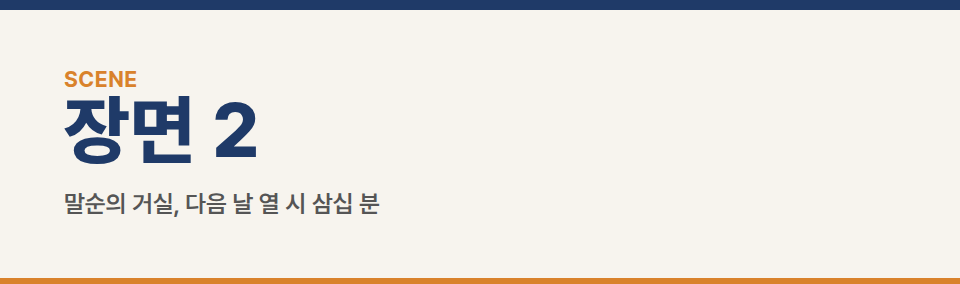
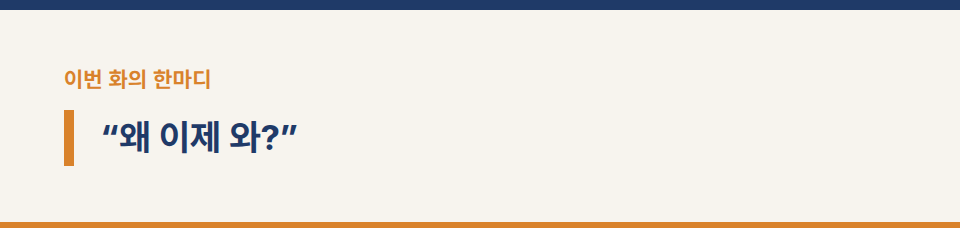
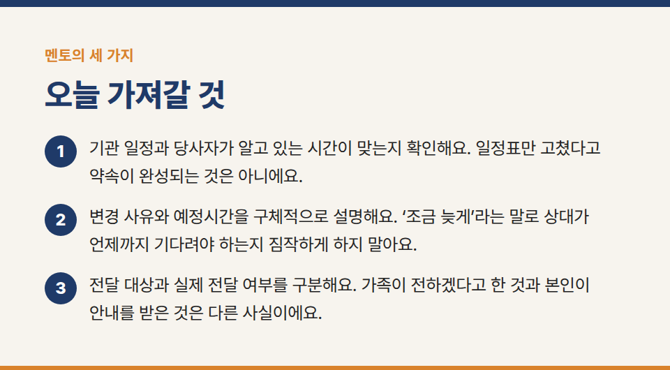
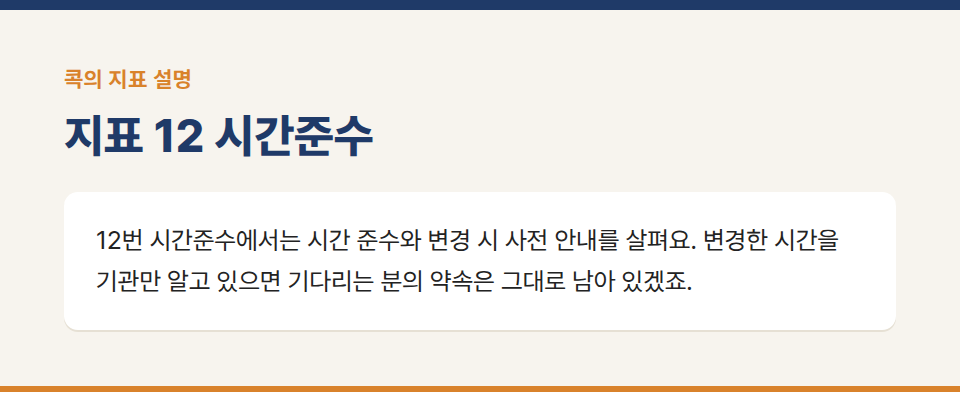
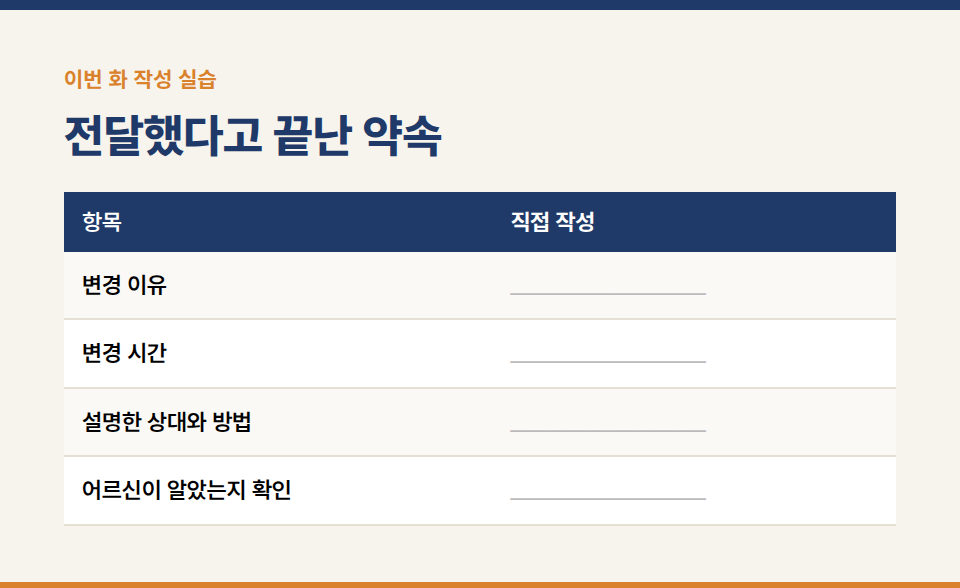
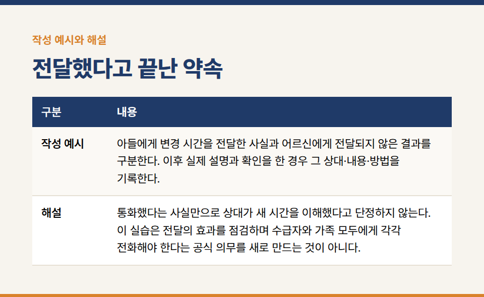

카테고리: 평가바이블365 연재
[평가바이블365 연재 10화] 좋은 뜻으로 한 약속

장기요양기관의 실무지침서 **『평가바이블365 [방문요양] 1. 행동편』** 연재 10/20화입니다.

※ 이야기에 등장하는 인물·기관·사건은 모두 가상입니다.

### 지표 12 시간준수

## 장면 1 · 기관 사무실, 전날 오후

말순 어르신의 아들에게 전화가 왔다. 다음 날 방문을 열 시에서 열 시 삼십 분으로 바꿀 수 있느냐는 요청이었다. 지우는 담당 직원의 일정과 제공에 미칠 영향을 확인하고 변경 시간을 조율했다. 수진은 옆에서 통화와 일정 조정을 지켜봤다.

“그럼 내일 열 시 삼십 분으로 안내드리겠습니다.”

“어머니께는 제가 말씀드릴게요.”

지우는 달력에서 ‘10:00’을 지우고 ‘10:30’을 썼다. 전화도 했고 일정도 바꿨다. 해야 할 일을 다 마친 기분이었다.

## 장면 2 · 말순의 거실, 다음 날 열 시 삼십 분

수진과 지우가 담당 직원과 함께 들어갔을 때 어르신은 외출복 차림으로 앉아 있었다. 탁자 위에는 다 식은 차가 있었다.

“왜 이제 와?”

지우는 벽시계를 봤다. 열 시 삼십 분이었다.

“오늘은 시간을 바꿔서—”

“나는 열 시부터 기다렸는데.”

어르신의 말이 끝나자 지우는 가방에서 일정표를 꺼내려던 손을 멈췄다. 기관의 일정표를 보여 드려도 기다린 삼십 분이 없어지지는 않았다.

“아드님과 시간을 조율했는데, 어르신께 전달됐는지 제가 확인하지 못했습니다. 기다리시게 해서 죄송합니다.”

“알았으면 다른 거라도 했지.”

지우는 변경 이유와 오늘의 예정 내용을 다시 설명하고 불편해진 일정이 있는지 물었다. 가족에게 책임을 돌리는 말은 하지 않았다. 기관이 확인한 것과 확인하지 못한 것을 분명히 했다.

## 장면 3 · 거실, 다음 연락 방법

“다음에 시간이 달라지면 어떤 방법으로 안내드리는 게 편하세요?”

어르신이 전화기를 가리켰다.

“나한테도 알아듣게 말해 줘. 언제 온다는 건지.”

지우는 실제로 합의한 안내 방법을 적었다. 모든 가정에 똑같은 연락 방식을 적용할 수는 없지만, 이 가정에서 어떻게 전달해야 하는지는 더 분명해졌다. 아들에게도 오늘 전달이 이어지지 않았던 상황을 확인하고 앞으로의 방법을 맞췄다.

## 멘토의 세 가지

방문 뒤 수진은 두 개의 시간을 수첩에 적었다. 기관이 알고 있던 열 시 삼십 분, 어르신이 알고 있던 열 시.

1. “기관 일정과 당사자가 알고 있는 시간이 맞는지 확인해요. 일정표만 고쳤다고 약속이 완성되는 것은 아니에요.”
2. “변경 사유와 예정시간을 구체적으로 설명해요. ‘조금 늦게’라는 말로 상대가 언제까지 기다려야 하는지 짐작하게 하지 말아요.”
3. “전달 대상과 실제 전달 여부를 구분해요. 가족이 전하겠다고 한 것과 본인이 안내를 받은 것은 다른 사실이에요.”

지우는 달력 옆에 연락 메모를 붙였다. 시간을 바꾸는 일에는 숫자를 고치는 것보다 많은 일이 들어 있었다.

## 콕의 마지막 한 지표 · 시간준수

콕이 양손에 시계를 하나씩 들고 등장한다. 하나는 열 시, 다른 하나는 열 시 삼십 분을 가리킨다.

“제 시계로는 정시입니다!”

빈 의자에서 말풍선이 올라온다.

“나는 어느 시계를 보고 기다려요?”

콕은 두 시계를 나란히 내려놓는다.

“여기 하나만 콕! **12번 시간준수**에서는 시간 준수와 변경 시 사전 안내를 살펴요. 변경한 시간을 기관만 알고 있으면 기다리는 분의 약속은 그대로 남아 있겠죠.”

**보관 원문 대조 요약:** 총 2점. 시간 준수 1점, 변경 시 사전 안내 1점. 수급자·보호자 면담으로 확인하며 변경 사유와 예정시간 등을 충분히 설명했는지 본다. 모든 경우에 본인과 보호자 모두에게 각각 전화해야 한다는 규칙을 새로 만들지 않는다. 전달 확인은 혼란을 줄이는 실무 방법이다.

**실습 연결:** 부록 실습 10. 변경 이유·시간·설명한 상대·실제 전달 여부를 나눈다. ‘조금 늦게 갑니다’를 구체적인 안내로 고치되, 아직 조율하지 않은 시간을 확정된 약속처럼 쓰지 않는다.

## 이번 화 작성 실습 — 전달했다고 끝난 약속

**상황:** 방문이 10시에서 10시 30분으로 바뀐다. 아들에게 알렸지만 어르신은 10시부터 기다렸다.

### 직접 작성

- 변경 이유: ____________________
- 변경 시간: ____________________
- 설명한 상대와 방법: ____________________
- 어르신이 알았는지 확인: ____________________

**작성 예시:** 아들에게 변경 시간을 전달한 사실과 어르신에게 전달되지 않은 결과를 구분한다. 이후 실제 설명과 확인을 한 경우 그 상대·내용·방법을 기록한다.

**해설:** 통화했다는 사실만으로 상대가 새 시간을 이해했다고 단정하지 않는다. 이 실습은 전달의 효과를 점검하며 수급자와 가족 모두에게 각각 전화해야 한다는 공식 의무를 새로 만드는 것이 아니다.

**짝 토의:** 작성한 문장 중 직접 확인한 사실에 밑줄을 긋고, 앞으로 할 일에는 동그라미를 표시한다. 상대가 사실로 오해할 표현이 있는지 서로 확인한다.

※ 공식 평가기준은 국민건강보험공단의 최신 평가매뉴얼과 공지를 함께 확인해 주세요.

※ 장기요양기관 평가·청구 실무 문의: 동행솔루션 042-673-3338 / donghangsol@naver.com
