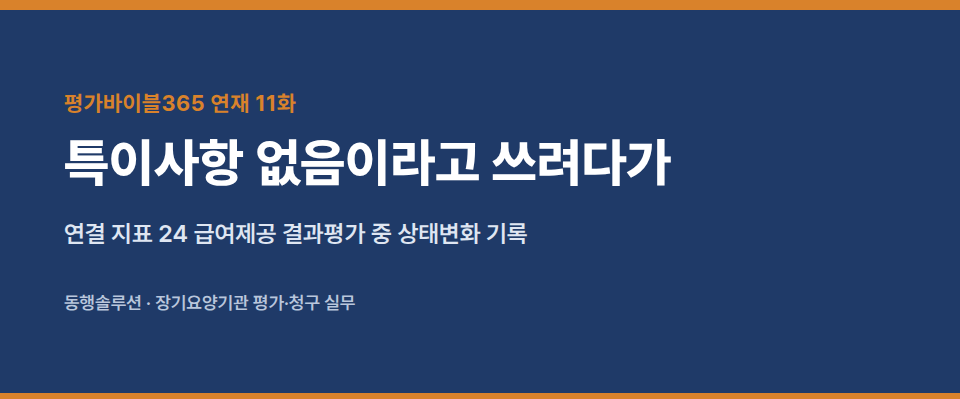
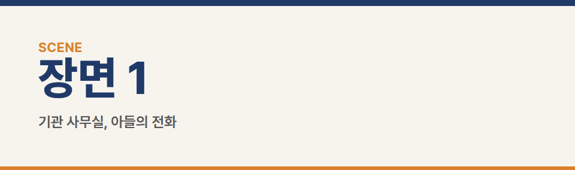
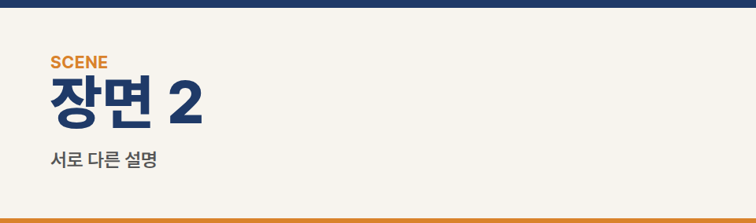
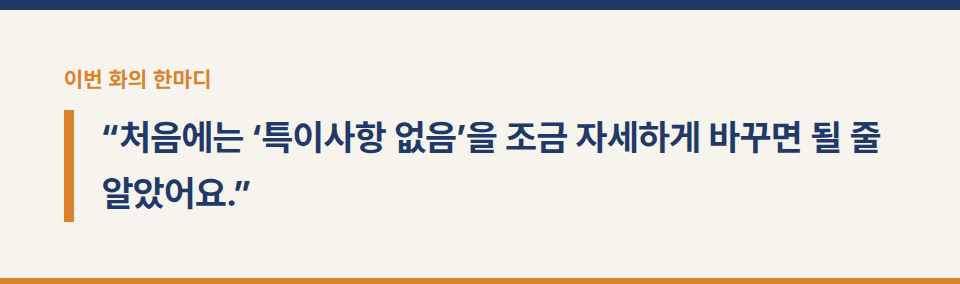
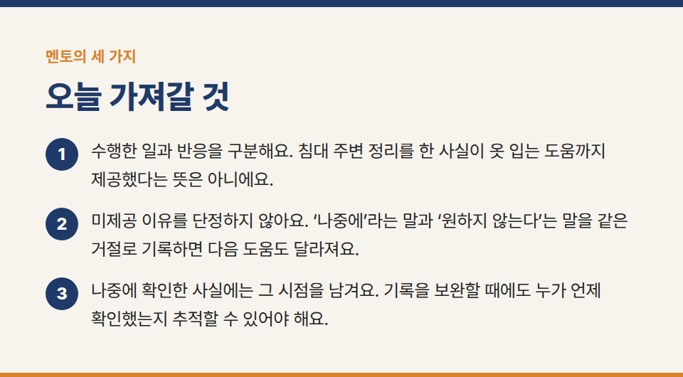
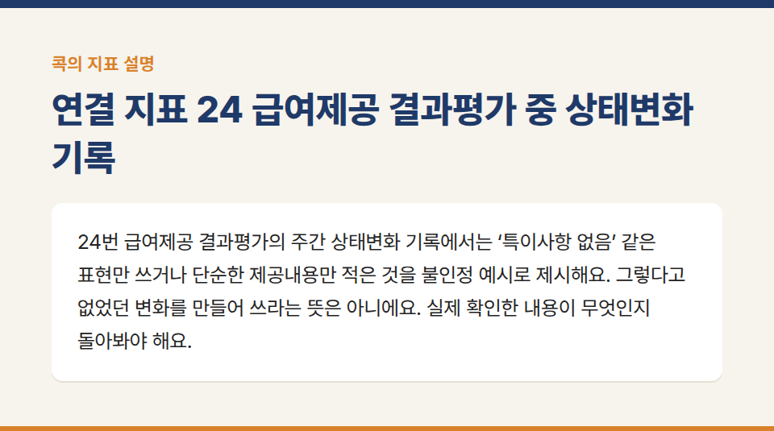
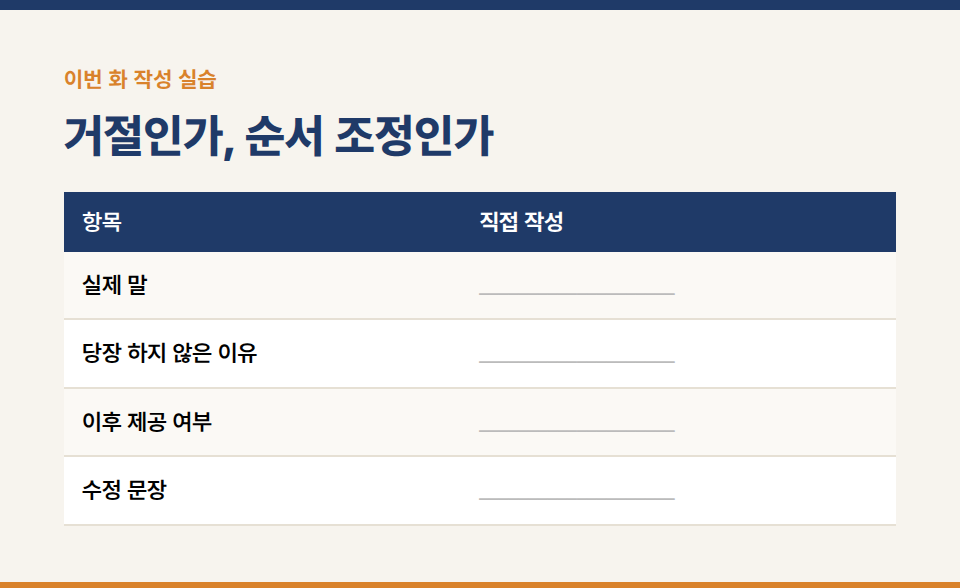
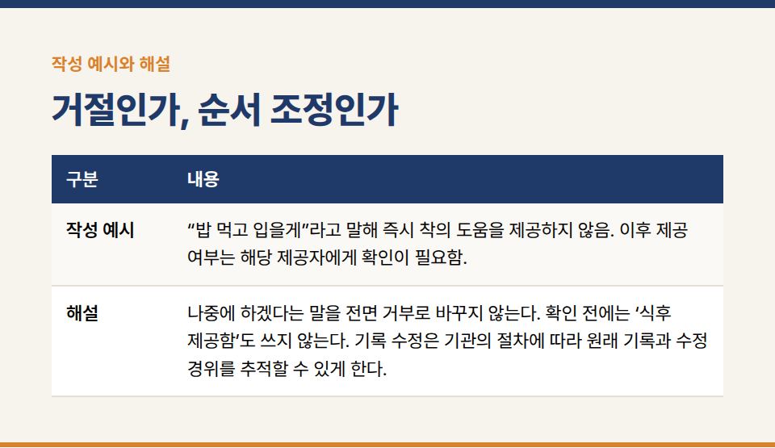

카테고리: 평가바이블365 연재
[평가바이블365 연재 11화] 특이사항 없음이라고 쓰려다가

장기요양기관의 실무지침서 **『평가바이블365 [방문요양] 1. 행동편』** 연재 11/20화입니다.

※ 이야기에 등장하는 인물·기관·사건은 모두 가상입니다.

### 연결 지표 24 급여제공 결과평가 중 상태변화 기록

## 장면 1 · 기관 사무실, 아들의 전화

“어머니가 오늘 도움을 못 받으셨다고 하세요.”

지우는 기록을 열었다. 제공 항목에 표시가 있었고 짧은 메모에는 ‘특이사항 없음’이라고 적혀 있었다. 처음에는 어느 쪽 말이 맞는지부터 가리고 싶었다.

“어떤 도움을 말씀하시는지 확인하겠습니다.”

지우는 오늘 담당한 은희와 말순 어르신에게 각각 이야기를 들었다. 수진은 통화와 확인 과정에 함께했다.

## 장면 2 · 서로 다른 설명

은희는 침대 주변을 정리했다고 말했다. 어르신은 옷을 갈아입는 도움을 받지 못했다고 말했다. 서로 다른 일을 말하고 있었다.

“옷은 처음에 안 하신다고 하셔서요.”

“어떤 말씀을 하셨나요?”

은희가 잠시 생각했다.

“밥 먹고 하겠다고 하셨어요.”

어르신에게도 같은 대목을 확인했다.

“안 입는다고 한 게 아니야. 밥 먹고 입겠다고 했지.”

지우는 ‘거부’라는 단어를 쓰지 않았다. 순서를 미룬 말이 오늘은 필요 없다는 뜻으로 이해됐고, 이후 다시 확인하지 못했다는 내용이 드러났다. 침상 주변 정리를 했다는 사실도 지우지 않았다. 수행한 도움과 놓친 도움은 따로 적어야 했다.

## 장면 3 · 수정하려는 손

지우는 기존 기록의 문장을 바꾸려다가 멈췄다. 지금 확인한 설명을 당시 곧바로 확인했던 것처럼 덮어쓰면 시간의 순서가 사라졌다.

수진과 함께 기관의 정정·추가기록 절차를 확인했다. 실제 제공자가 기록한 내용, 나중에 확인한 당사자의 말, 확인한 시점을 구분했다. 지우가 제공자 대신 과거 일을 직접 수행한 것처럼 기록하지도 않았다.

어르신에게 현재 필요한 도움이 남아 있는지 확인하고 기관에서 가능한 후속 대응을 조율했다. 아직 진행하지 않은 조치는 완료로 표시하지 않았다.

지우가 말했다.

“처음에는 ‘특이사항 없음’을 조금 자세하게 바꾸면 될 줄 알았어요.”

수진은 새로 확인한 발언에 밑줄을 그었다.

“무엇을 뜻했는지 확인하는 일이 먼저였네요.”

## 멘토의 세 가지

1. “수행한 일과 반응을 구분해요. 침대 주변 정리를 한 사실이 옷 입는 도움까지 제공했다는 뜻은 아니에요.”
2. “미제공 이유를 단정하지 않아요. ‘나중에’라는 말과 ‘원하지 않는다’는 말을 같은 거절로 기록하면 다음 도움도 달라져요.”
3. “나중에 확인한 사실에는 그 시점을 남겨요. 기록을 보완할 때에도 누가 언제 확인했는지 추적할 수 있어야 해요.”

지우는 앞으로 쓸 질문을 수첩에 적었다. ‘지금 하지 않으신다면, 언제 다시 여쭤보면 될까요?’ 실제 일정과 제공 가능 조건 속에서 확인할 질문이었다.

## 콕의 마지막 한 지표 · 상태변화 기록

콕이 도장을 연달아 찍는다. 식사 종이에도, 옷 종이에도, 빈 종이에도 ‘특이사항 없음’이 찍힌다.

수첩이 묻는다.

“오늘 무슨 일이 있었어?”

콕이 종이를 한 장씩 넘긴다. 전부 같은 말이다.

“분명 일을 했는데, 종이는 아무 말도 안 하네.”

“여기 하나만 콕! **24번 급여제공 결과평가**의 주간 상태변화 기록에서는 ‘특이사항 없음’ 같은 표현만 쓰거나 단순한 제공내용만 적은 것을 불인정 예시로 제시해요. 그렇다고 없었던 변화를 만들어 쓰라는 뜻은 아니에요. 실제 확인한 내용이 무엇인지 돌아봐야 해요.”

**기준과 사례의 구분:** 이 장은 제공내용·당사자 반응·뒤늦은 확인을 구분하는 사례다. 상담 추가기록이 실제 제공자의 상태변화 기록을 대신하지는 않는다. 공식 작성 조건과 배점은 20장의 대조 요약에서 확인한다.

**실습 연결:** 부록 실습 11. 실제 발언, 제공한 도움, 제공하지 못한 도움, 재확인하지 못한 점을 나누어 기록한다. 이후 조치는 실제로 수행한 범위만 추가한다.

## 이번 화 작성 실습 — 거절인가, 순서 조정인가

**상황:** 어르신은 “밥 먹고 입을게”라고 했다. 기록 초안에는 ‘착의 도움 거부’가 적혔다.

### 직접 작성

- 실제 말: ____________________
- 당장 하지 않은 이유: ____________________
- 이후 제공 여부: ____________________
- 수정 문장: ____________________

**작성 예시:** “밥 먹고 입을게”라고 말해 즉시 착의 도움을 제공하지 않음. 이후 제공 여부는 해당 제공자에게 확인이 필요함.

**해설:** 나중에 하겠다는 말을 전면 거부로 바꾸지 않는다. 확인 전에는 ‘식후 제공함’도 쓰지 않는다. 기록 수정은 기관의 절차에 따라 원래 기록과 수정 경위를 추적할 수 있게 한다.

**짝 토의:** 작성한 문장 중 직접 확인한 사실에 밑줄을 긋고, 앞으로 할 일에는 동그라미를 표시한다. 상대가 사실로 오해할 표현이 있는지 서로 확인한다.

※ 공식 평가기준은 국민건강보험공단의 최신 평가매뉴얼과 공지를 함께 확인해 주세요.

※ 장기요양기관 평가·청구 실무 문의: 동행솔루션 042-673-3338 / donghangsol@naver.com
