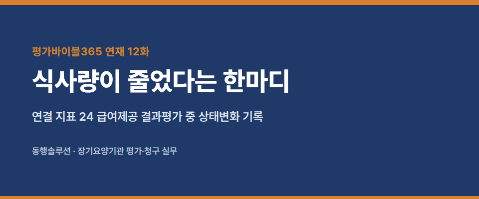
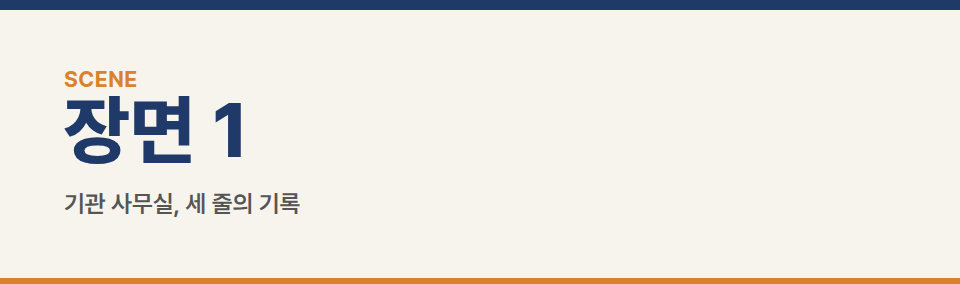
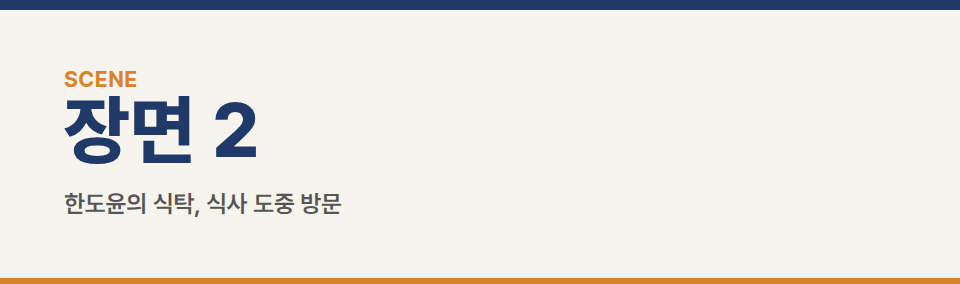
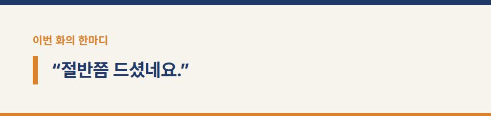
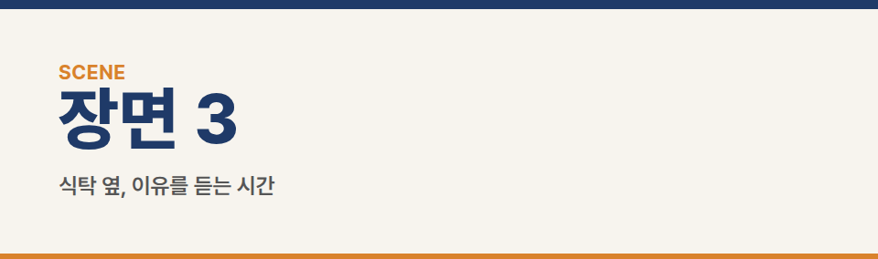
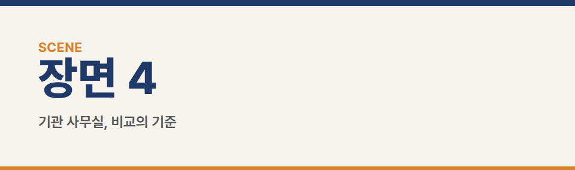
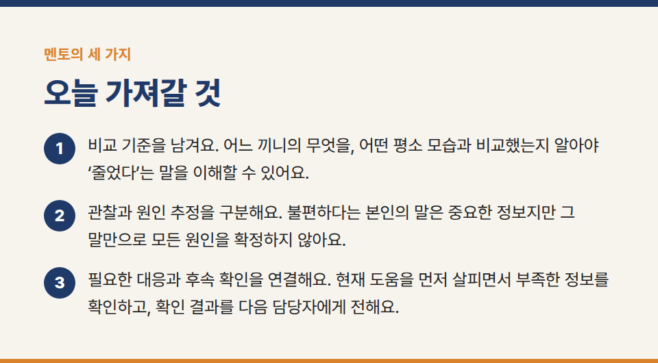
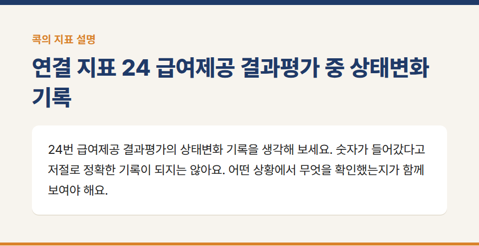
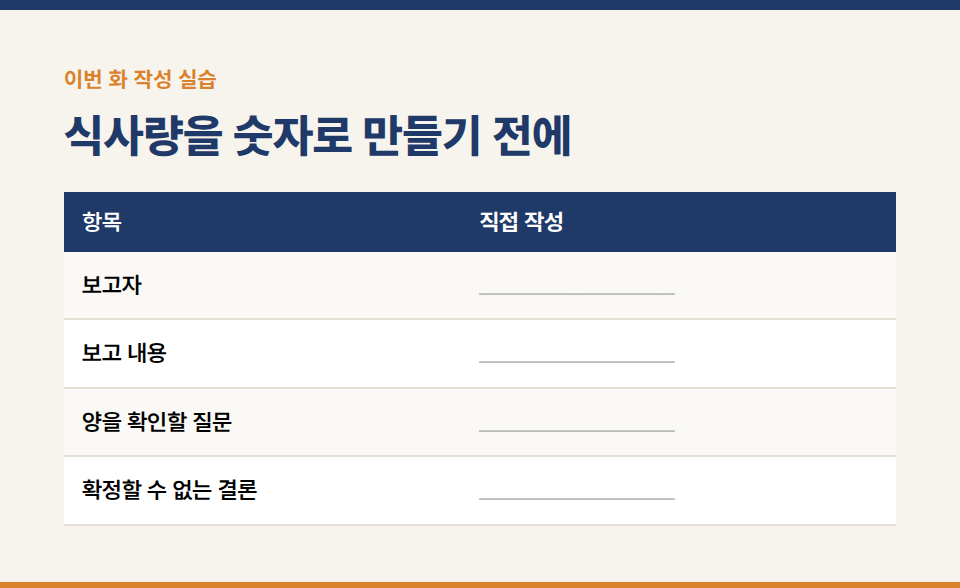
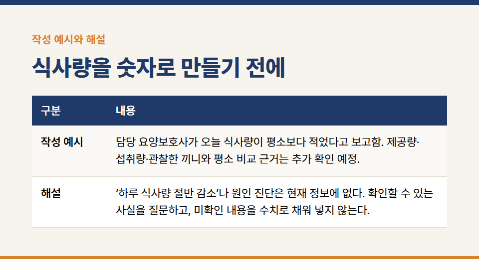

카테고리: 평가바이블365 연재
[평가바이블365 연재 12화] 식사량이 줄었다는 한마디

장기요양기관의 실무지침서 **『평가바이블365 [방문요양] 1. 행동편』** 연재 12/20화입니다.

※ 이야기에 등장하는 인물·기관·사건은 모두 가상입니다.

### 연결 지표 24 급여제공 결과평가 중 상태변화 기록

## 장면 1 · 기관 사무실, 세 줄의 기록

서로 다른 날의 기록에 ‘식사량 감소’가 반복돼 있었다. 지우는 세 줄을 차례로 읽었다.

“계속 줄어드신 건가요?”

수진은 함께 자료를 봤다. 어느 끼니인지, 평소 무엇과 비교했는지, 처음 얼마나 제공했는지는 충분히 드러나지 않았다. 같은 말이 반복된다고 감소 폭이 커졌다는 뜻은 아니었다.

담당 직원에게 구체적인 관찰을 확인하기로 했다. 현재 상태에 필요한 대응도 함께 살피면서, 기록만 읽고 이미 추세를 안다고 말하지 않기로 했다.

## 장면 2 · 한도윤의 식탁, 식사 도중 방문

지우가 도착했을 때 식사는 이미 시작된 뒤였다. 밥그릇 안쪽으로 밥이 조금 남아 있었다.

“절반쯤 드셨네요.”

어르신이 숟가락을 내려놓았다.

“처음에 얼마나 담았는지 봤어?”

지우는 그릇을 다시 봤다. 본 것은 남은 밥이었다. 처음 담은 밥도, 먹는 과정 전체도 아니었다.

“아니요. 제가 남은 것만 보고 말씀드렸네요.”

어르신은 그릇을 손끝으로 밀었다.

“오늘은 처음부터 적게 달라고 했어.”

지우는 처음 제공한 양을 누가 알고 있는지 확인했다. 남은 양을 보고 비율을 추측해 적는 대신, 지금 알 수 있는 정보부터 모았다. 반찬과 밥, 점심과 하루 전체도 같은 것으로 묶지 않았다.

## 장면 3 · 식탁 옆, 이유를 듣는 시간

“적게 달라고 하신 이유가 있으세요?”

“입안이 좀 불편해.”

지우의 머릿속에 ‘입안 불편 때문에 식사량 감소’라는 문장이 빠르게 만들어졌다. 그러나 어르신이 말한 불편과 전체 섭취량의 원인을 확정하는 것은 다른 일이었다.

지우는 어르신의 표현을 그대로 남기고, 언제부터 어떤 불편이 있었는지 필요한 범위에서 확인했다. 수진과 함께 기관의 절차에 따라 현재 상태에 필요한 대응을 연결했다. 원인을 임의로 진단하지 않았고, 기록을 완성할 때까지 대응을 미루지도 않았다.

담당 직원이 아는 제공량과 관찰한 끼니를 따로 확인했다. 확인되지 않는 내용은 확인되지 않는다고 남겼다. 수치가 없다는 이유로 기억나지 않는 양을 만들어 달라고 요구하지 않았다.

## 장면 4 · 기관 사무실, 비교의 기준

지우는 새 메모를 세 칸으로 나눴다. 직접 본 것, 들은 말, 더 확인할 것.

“숫자로 쓰면 정확해지는 줄 알았어요.”

수진이 물었다.

“그 숫자를 어떻게 알았는지도 설명할 수 있어야겠죠?”

지우는 ‘절반’이라는 표현을 지웠다. 그 자리에 ‘식사 도중 도착해 잔여 음식만 관찰함’이라고 썼다. 쓸 수 있는 말은 줄었지만 사실은 더 분명해졌다.

## 멘토의 세 가지

1. “비교 기준을 남겨요. 어느 끼니의 무엇을, 어떤 평소 모습과 비교했는지 알아야 ‘줄었다’는 말을 이해할 수 있어요.”
2. “관찰과 원인 추정을 구분해요. 불편하다는 본인의 말은 중요한 정보지만 그 말만으로 모든 원인을 확정하지 않아요.”
3. “필요한 대응과 후속 확인을 연결해요. 현재 도움을 먼저 살피면서 부족한 정보를 확인하고, 확인 결과를 다음 담당자에게 전해요.”

## 콕의 마지막 한 지표 · 상태변화 기록

콕이 작은 밥그릇과 큰 대접을 나란히 놓는다. 둘 다 절반쯤 차 있다.

“둘 다 절반! 완전히 같습니다!”

두 그릇의 음식을 같은 크기의 그릇으로 옮겨 담자 양이 달라진다. 콕은 눈금을 그리려던 자를 내려놓는다.

“여기 하나만 콕! **24번 급여제공 결과평가**의 상태변화 기록을 생각해 보세요. 숫자가 들어갔다고 저절로 정확한 기록이 되지는 않아요. 어떤 상황에서 무엇을 확인했는지가 함께 보여야 해요.”

**기준과 사례의 구분:** 비교 기준과 출처를 구분하는 방법은 이 책의 자체 작성 연습이다. 모든 식사를 무게나 비율로 측정해야 한다는 공식 의무를 만드는 것이 아니다. 필요한 관찰·기록은 실제 상황과 적용되는 업무 기준에 맞춘다. 상세 배점과 조건은 20장에서 확인한다.

**실습 연결:** 부록 실습 12. 보호자가 설명한 저녁 식사, 직원이 본 점심 잔여 음식, 본인이 표현한 불편을 나누어 쓴다. 이를 근거 없이 ‘하루 섭취량 절반 감소’로 합치지 않는다.

## 이번 화 작성 실습 — 식사량을 숫자로 만들기 전에

**상황:** 미경이 “오늘 식사를 덜 하셨어요”라고 보고한다. 평소 양과 오늘 먹은 양은 아직 확인되지 않았다.

### 직접 작성

- 보고자: ____________________
- 보고 내용: ____________________
- 양을 확인할 질문: ____________________
- 확정할 수 없는 결론: ____________________

**작성 예시:** 담당 요양보호사가 오늘 식사량이 평소보다 적었다고 보고함. 제공량·섭취량·관찰한 끼니와 평소 비교 근거는 추가 확인 예정.

**해설:** ‘하루 식사량 절반 감소’나 원인 진단은 현재 정보에 없다. 확인할 수 있는 사실을 질문하고, 미확인 내용을 수치로 채워 넣지 않는다.

**짝 토의:** 작성한 문장 중 직접 확인한 사실에 밑줄을 긋고, 앞으로 할 일에는 동그라미를 표시한다. 상대가 사실로 오해할 표현이 있는지 서로 확인한다.

※ 공식 평가기준은 국민건강보험공단의 최신 평가매뉴얼과 공지를 함께 확인해 주세요.

※ 장기요양기관 평가·청구 실무 문의: 동행솔루션 042-673-3338 / donghangsol@naver.com
