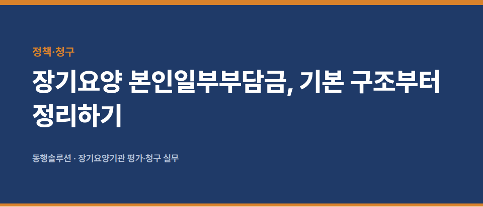
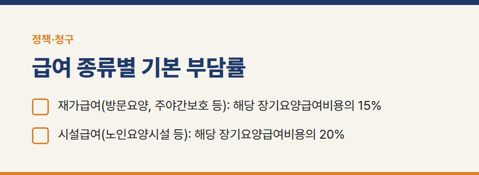
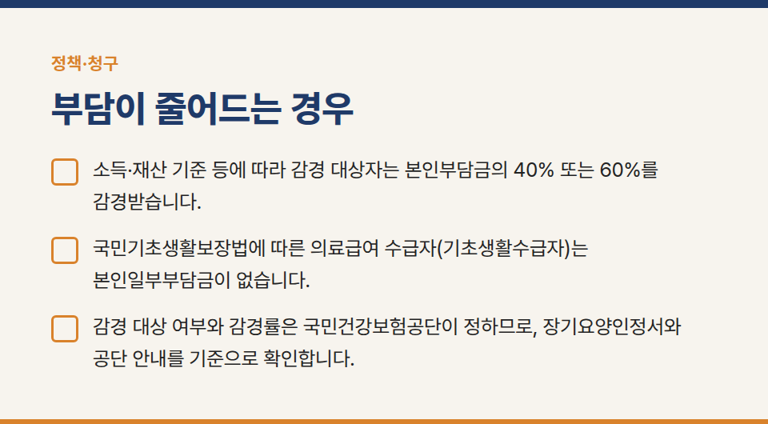
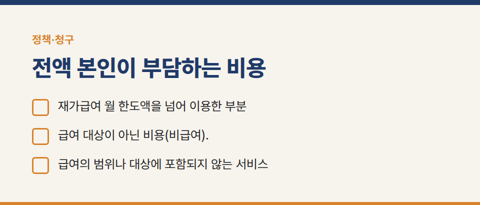
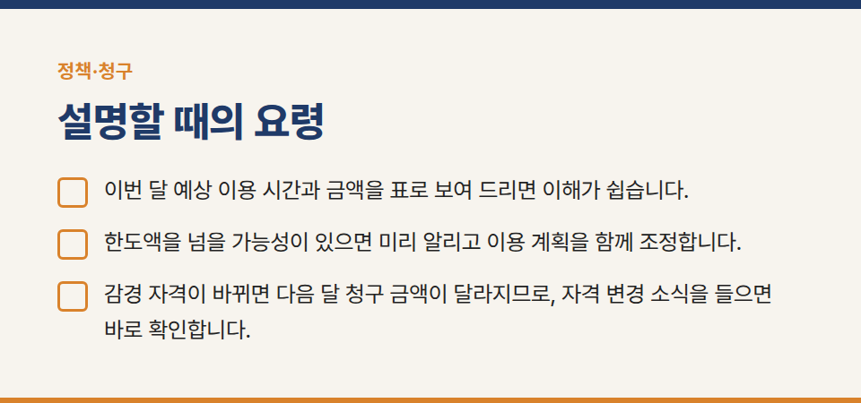
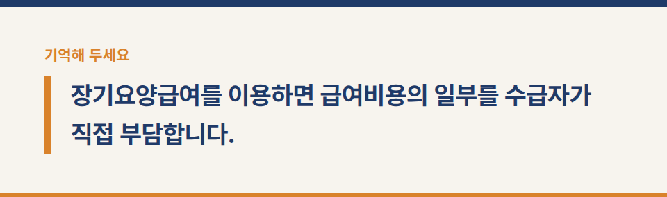
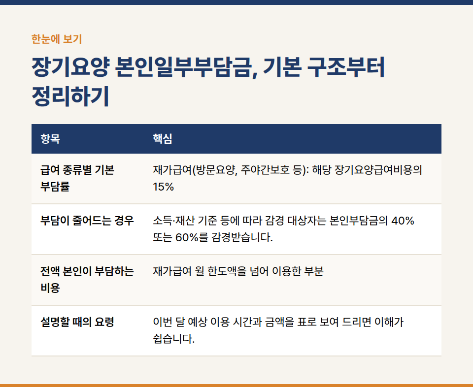

카테고리: 정책·청구
장기요양 본인일부부담금, 기본 구조부터 정리하기

장기요양급여를 이용하면 급여비용의 일부를 수급자가 직접 부담합니다. 이를 본인일부부담금이라고 합니다. 수급자와 보호자께 설명할 때 헷갈리기 쉬운 기본 구조를 정리했습니다.

## 급여 종류별 기본 부담률

- 재가급여(방문요양, 주야간보호 등): 해당 장기요양급여비용의 15%
- 시설급여(노인요양시설 등): 해당 장기요양급여비용의 20%

## 부담이 줄어드는 경우

- 소득·재산 기준 등에 따라 감경 대상자는 본인부담금의 40% 또는 60%를 감경받습니다.
- 국민기초생활보장법에 따른 의료급여 수급자(기초생활수급자)는 본인일부부담금이 없습니다.
- 감경 대상 여부와 감경률은 국민건강보험공단이 정하므로, 장기요양인정서와 공단 안내를 기준으로 확인합니다.

## 전액 본인이 부담하는 비용

- 재가급여 월 한도액을 넘어 이용한 부분
- 급여 대상이 아닌 비용(비급여). 예를 들어 시설의 식사 재료비, 상급침실 이용 차액, 이·미용비 등
- 급여의 범위나 대상에 포함되지 않는 서비스

## 설명할 때의 요령

- 이번 달 예상 이용 시간과 금액을 표로 보여 드리면 이해가 쉽습니다.
- 한도액을 넘을 가능성이 있으면 미리 알리고 이용 계획을 함께 조정합니다.
- 감경 자격이 바뀌면 다음 달 청구 금액이 달라지므로, 자격 변경 소식을 들으면 바로 확인합니다.

※ 부담률과 비급여 항목은 법령과 고시 개정에 따라 바뀔 수 있습니다. 최신 기준은 국민건강보험공단 노인장기요양보험 누리집에서 확인해 주세요.

장기요양기관 평가·청구 실무 문의: 동행솔루션 042-673-3338 / donghangsol@naver.com
