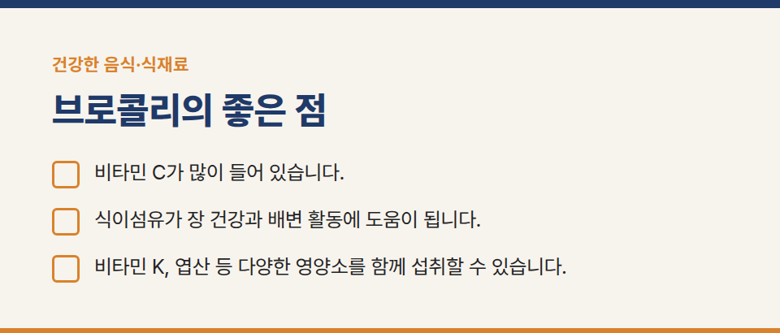
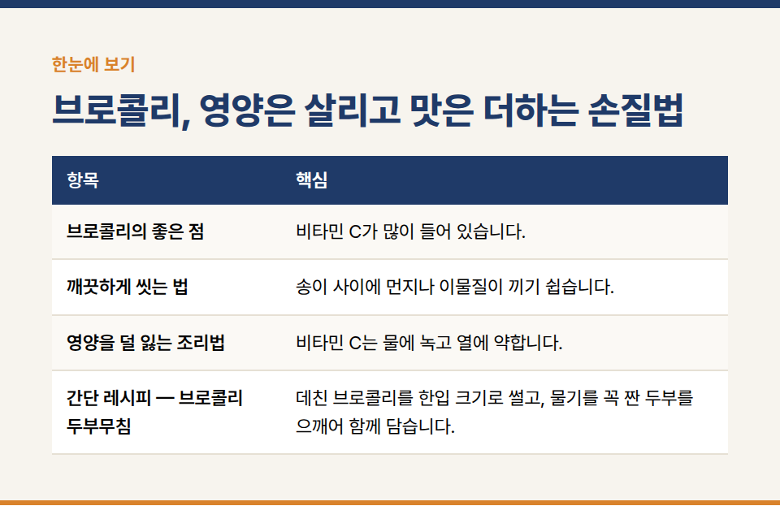

카테고리: 건강한 음식·식재료
브로콜리, 영양은 살리고 맛은 더하는 손질법

브로콜리는 비타민 C와 식이섬유가 풍부한 대표적인 녹색 채소입니다. 어떻게 손질하고 익히느냐에 따라 맛과 영양이 꽤 달라집니다.

## 브로콜리의 좋은 점

- 비타민 C가 많이 들어 있습니다.
- 식이섬유가 장 건강과 배변 활동에 도움이 됩니다.
- 비타민 K, 엽산 등 다양한 영양소를 함께 섭취할 수 있습니다.

## 깨끗하게 씻는 법

송이 사이에 먼지나 이물질이 끼기 쉽습니다. 송이를 아래로 향하게 해서 물에 5분 정도 담갔다가 흐르는 물에 헹궈 주세요. 줄기도 껍질만 얇게 벗기면 아삭하고 맛있게 먹을 수 있습니다.

## 영양을 덜 잃는 조리법

- 비타민 C는 물에 녹고 열에 약합니다. 오래 삶기보다는 짧게 찌거나, 끓는 물에 1분 안팎으로 살짝 데치는 것이 좋습니다.
- 어르신이 드시기에는 조금 더 부드럽게 익히고 작게 잘라 드리면 씹기 편합니다.

## 간단 레시피 — 브로콜리 두부무침

데친 브로콜리를 한입 크기로 썰고, 물기를 꼭 짠 두부를 으깨어 함께 담습니다. 참기름, 깨, 소금 약간으로 버무리면 부드럽고 고소한 반찬이 됩니다.

※ 질환이 있거나 약을 복용 중이라면 식단을 바꾸기 전에 의사나 영양사와 상담해 주세요.
