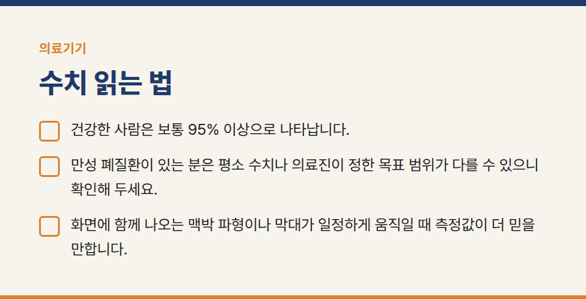
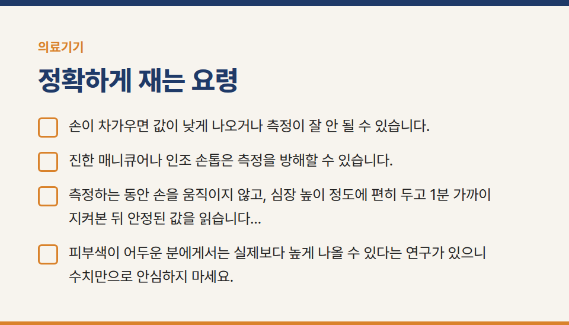
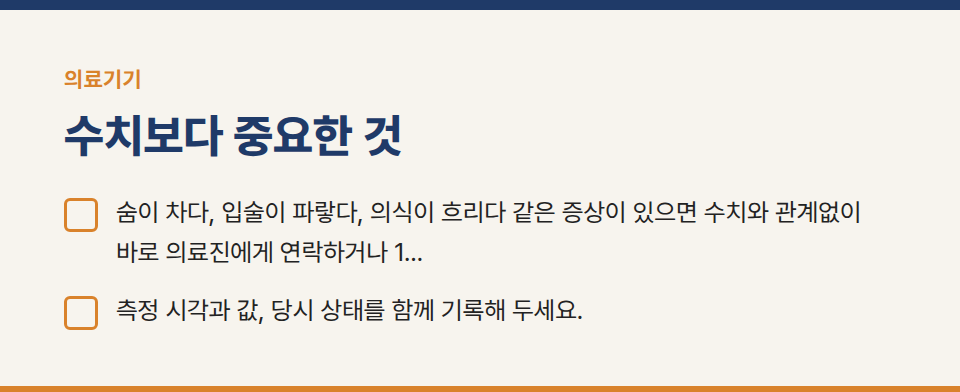
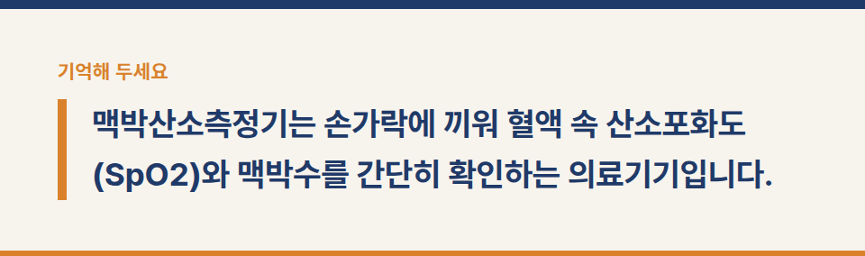
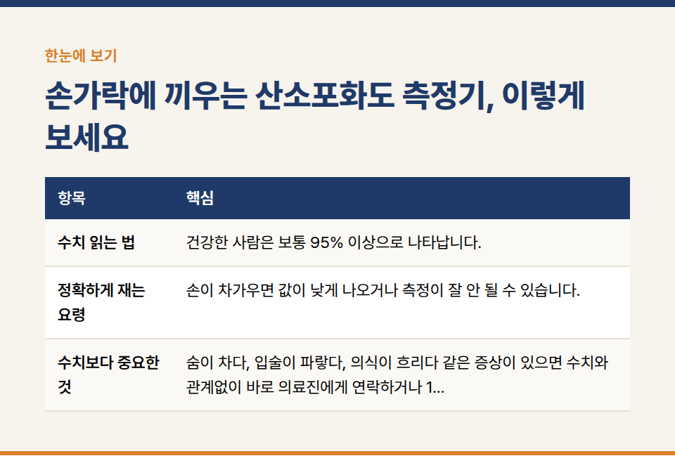
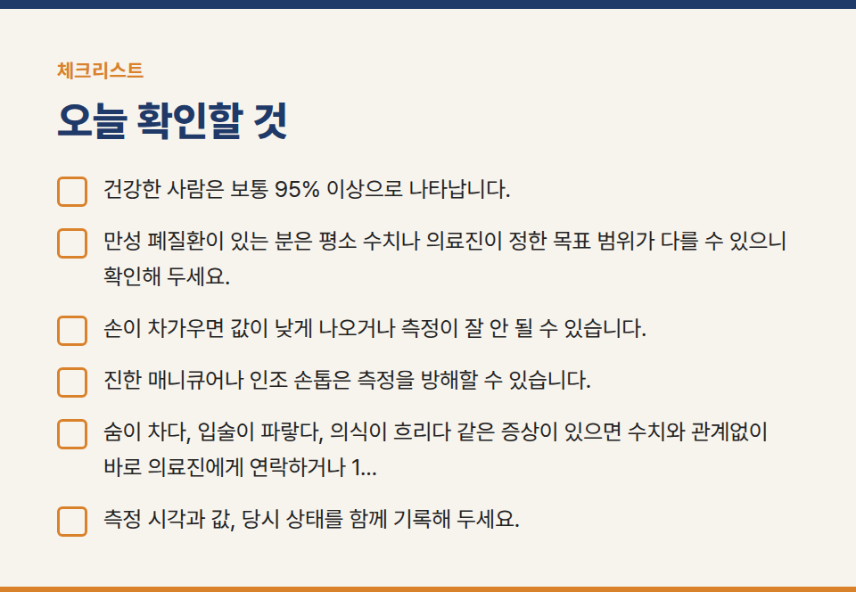

카테고리: 의료기기
손가락에 끼우는 산소포화도 측정기, 이렇게 보세요

맥박산소측정기는 손가락에 끼워 혈액 속 산소포화도(SpO2)와 맥박수를 간단히 확인하는 의료기기입니다. 호흡기 질환이 있는 분을 돌볼 때 자주 사용합니다.

## 수치 읽는 법

- 건강한 사람은 보통 95% 이상으로 나타납니다.
- 만성 폐질환이 있는 분은 평소 수치나 의료진이 정한 목표 범위가 다를 수 있으니 확인해 두세요.
- 화면에 함께 나오는 맥박 파형이나 막대가 일정하게 움직일 때 측정값이 더 믿을 만합니다.

## 정확하게 재는 요령

- 손이 차가우면 값이 낮게 나오거나 측정이 잘 안 될 수 있습니다. 손을 따뜻하게 한 뒤 잽니다.
- 진한 매니큐어나 인조 손톱은 측정을 방해할 수 있습니다.
- 측정하는 동안 손을 움직이지 않고, 심장 높이 정도에 편히 두고 1분 가까이 지켜본 뒤 안정된 값을 읽습니다.
- 피부색이 어두운 분에게서는 실제보다 높게 나올 수 있다는 연구가 있으니 수치만으로 안심하지 마세요.

## 수치보다 중요한 것

- 숨이 차다, 입술이 파랗다, 의식이 흐리다 같은 증상이 있으면 수치와 관계없이 바로 의료진에게 연락하거나 119에 도움을 요청해야 합니다.
- 측정 시각과 값, 당시 상태를 함께 기록해 두세요.

※ 이 글은 일반적인 사용 안내입니다. 제품별 사용법은 사용설명서를 따르고, 측정값이 평소와 다르거나 증상이 있으면 의료진과 상담해 주세요.
