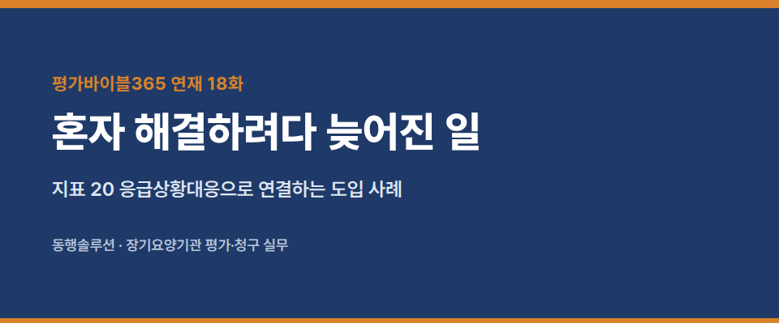
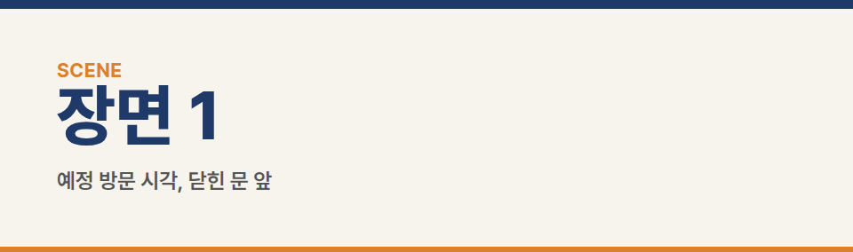
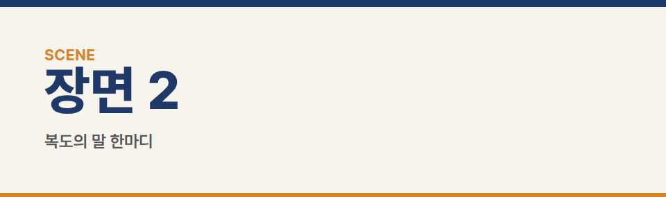
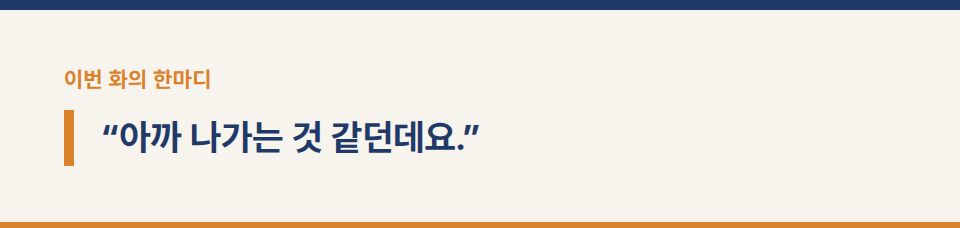
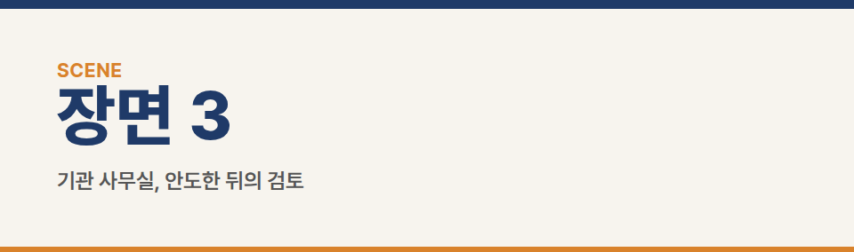
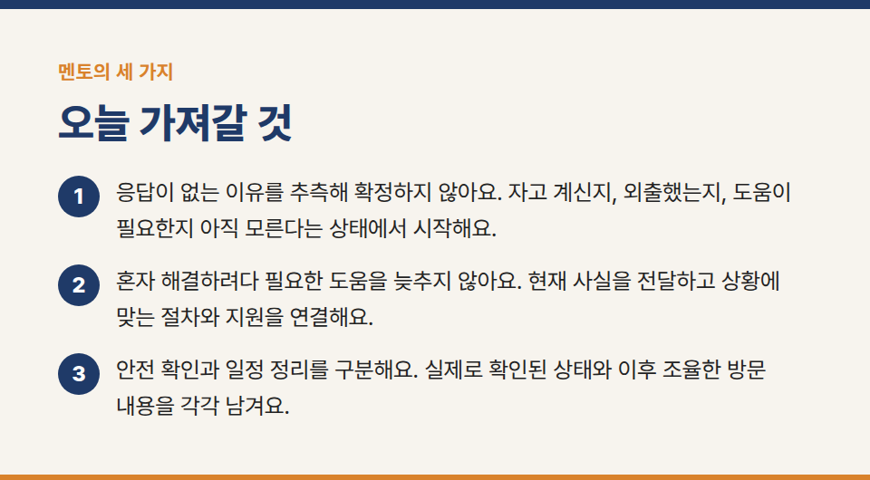
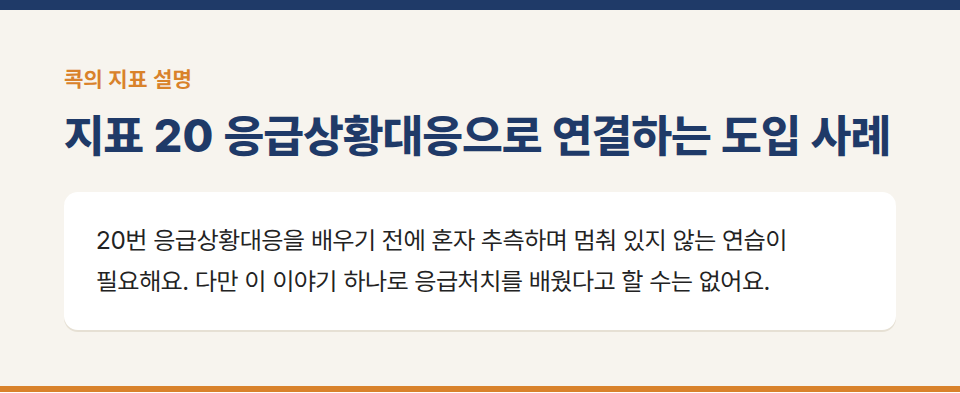
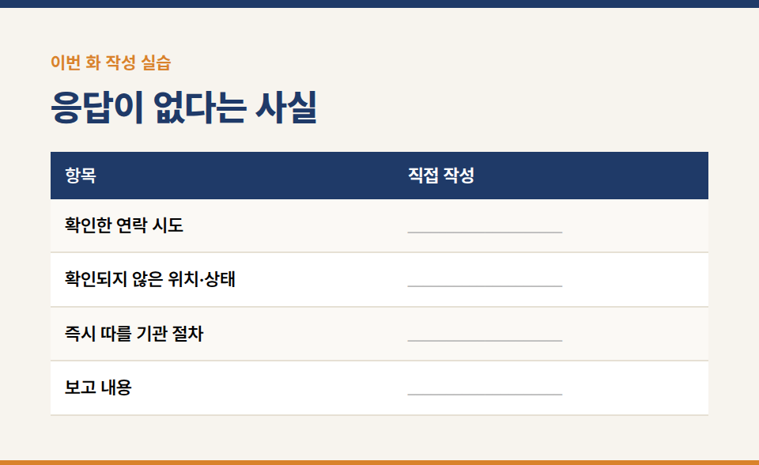
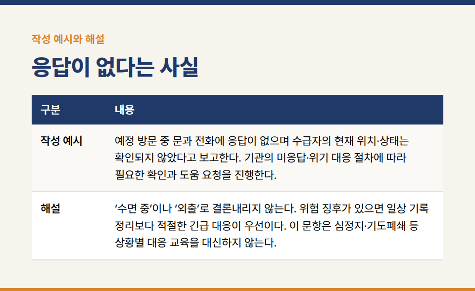

카테고리: 평가바이블365 연재
[평가바이블365 연재 18화] 혼자 해결하려다 늦어진 일

장기요양기관의 실무지침서 **『평가바이블365 [방문요양] 1. 행동편』** 연재 18/20화입니다.

※ 이야기에 등장하는 인물·기관·사건은 모두 가상입니다.

### 지표 20 응급상황대응으로 연결하는 도입 사례

## 장면 1 · 예정 방문 시각, 닫힌 문 앞

초인종을 눌렀지만 답이 없었다. 전화도 받지 않았다. 지우는 보호자에게 연락했지만 연결되지 않았다. 수진은 옆에서 함께 상황을 확인하고 있었다.

“문자 보냈으니까 한 번만 더 기다려 볼까요?”

지우가 전화기 화면을 봤다. 누군가 답해 주면 상황을 설명할 수 있을 것 같았다. 지금은 안에 계신지조차 몰랐다.

수진이 말했다.

“지금 확인된 사실로 기관 절차를 연결합시다. 혼자 이유를 알아낼 때까지 기다리는 건 아니에요.”

지우는 예정 방문 중 문과 전화에 응답이 없고, 현재 위치와 상태가 확인되지 않는다고 전달했다. 기관의 미응답·위기 대응 절차에 따라 필요한 확인과 도움 요청을 진행했다.

## 장면 2 · 복도의 말 한마디

이웃이 문을 열었다.

“아까 나가는 것 같던데요.”

지우는 안도하려다가 다시 물었다. 누구를 언제 보았는지 확인할 수 있는 범위에서 들었다. 그렇지만 그 말을 ‘안전하게 외출 중’이라는 확정된 상태로 바꾸지는 않았다.

필요한 확인을 이어가던 중 어르신과 직접 통화가 됐다. 가족과 외출 중이라는 설명을 들었다. 지우는 직접 확인한 내용과 앞서 들은 이웃의 추측을 구분했다. 이후 방문 일정과 연락 방법을 조율했다.

이 사례는 미응답 시의 보편적인 대기시간이나 출입 방법을 정하는 지침이 아니다. 위험 징후가 있으면 필요한 긴급 대응을 기관 승인 대기 때문에 늦추지 않아야 하며, 구체적인 상황별 행동은 검증된 대응 교육으로 다룬다.

## 장면 3 · 기관 사무실, 안도한 뒤의 검토

“외출이어서 다행이었어요.”

지우가 말했다. 수진도 고개를 끄덕였다.

“이번 결과가 괜찮았다는 것과 다음에도 같은 방식으로 기다려도 된다는 것은 다르죠.”

지우는 연락 시도와 확인 경과를 시간순으로 정리했다. 안전 상태 확인과 일정 변경은 다른 항목에 적었다. 약속 시간을 바꿨다는 기록만으로 그 전의 확인 과정을 덮지 않았다.

## 멘토의 세 가지

1. “응답이 없는 이유를 추측해 확정하지 않아요. 자고 계신지, 외출했는지, 도움이 필요한지 아직 모른다는 상태에서 시작해요.”
2. “혼자 해결하려다 필요한 도움을 늦추지 않아요. 현재 사실을 전달하고 상황에 맞는 절차와 지원을 연결해요.”
3. “안전 확인과 일정 정리를 구분해요. 실제로 확인된 상태와 이후 조율한 방문 내용을 각각 남겨요.”

## 콕의 마지막 한 지표 · 응급상황대응의 입구

콕이 전화기를 들고 동그란 길을 돈다. 한 바퀴 돌 때마다 “한 번만 더!”라고 외친다. 수첩이 길 한가운데 팻말을 세운다. ‘다음 연결은?’

“여기 하나만 콕! **20번 응급상황대응**을 배우기 전에 혼자 추측하며 멈춰 있지 않는 연습이 필요해요. 다만 이 이야기 하나로 응급처치를 배웠다고 할 수는 없어요.”

**보관 원문 확인 요약:** 지표 20은 총 5점. 응급상황 종류의 이해 2.5점, 제시한 상황에 적절한 대응방법을 아는지 2.5점이며 직원 면담으로 확인한다. 심정지·질식·경련·화상·낙상 등이 예시다. 현재의 연락 두절 이야기는 도움 요청을 배우는 도입일 뿐, 이 지표 전체의 응급처치 역량을 설명하지 못한다. 검증된 상황별 대응 교육과 연습 장면을 추가해야 한다. 이 부분은 미완료로 남긴다.

**실습 연결:** 부록 실습 18. 이웃의 추측과 직접 확인한 상태를 구분한다. 일률적인 대기시간이나 기관 승인을 항상 먼저 기다린다는 규칙을 만들지 않는다.

## 이번 화 작성 실습 — 응답이 없다는 사실

**상황:** 예정 방문 시 문을 두드리고 전화했으나 응답이 없다. 안에 있는지, 외출했는지도 모른다.

### 직접 작성

- 확인한 연락 시도: ____________________
- 확인되지 않은 위치·상태: ____________________
- 즉시 따를 기관 절차: ____________________
- 보고 내용: ____________________

**작성 예시:** 예정 방문 중 문과 전화에 응답이 없으며 수급자의 현재 위치·상태는 확인되지 않았다고 보고한다. 기관의 미응답·위기 대응 절차에 따라 필요한 확인과 도움 요청을 진행한다.

**해설:** ‘수면 중’이나 ‘외출’로 결론내리지 않는다. 위험 징후가 있으면 일상 기록 정리보다 적절한 긴급 대응이 우선이다. 이 문항은 심정지·기도폐쇄 등 상황별 대응 교육을 대신하지 않는다.

**짝 토의:** 작성한 문장 중 직접 확인한 사실에 밑줄을 긋고, 앞으로 할 일에는 동그라미를 표시한다. 상대가 사실로 오해할 표현이 있는지 서로 확인한다.

※ 공식 평가기준은 국민건강보험공단의 최신 평가매뉴얼과 공지를 함께 확인해 주세요.

※ 장기요양기관 평가·청구 실무 문의: 동행솔루션 042-673-3338 / donghangsol@naver.com
