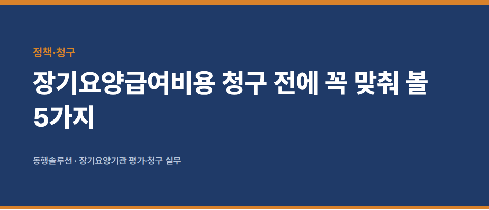
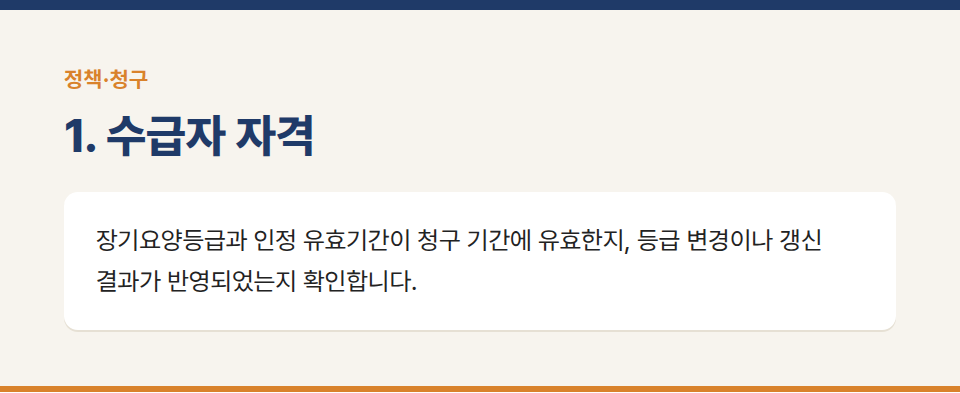
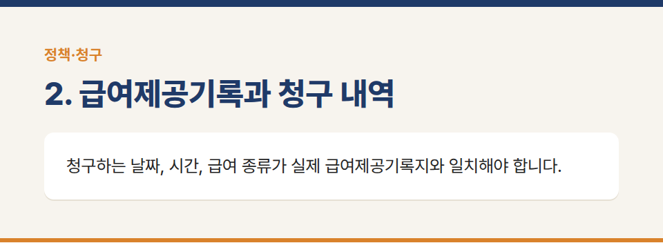
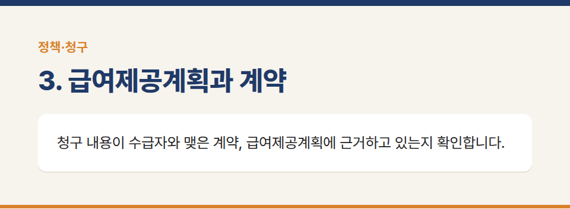
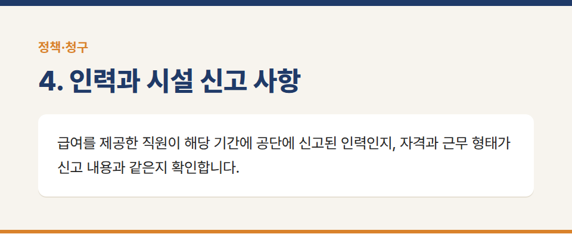
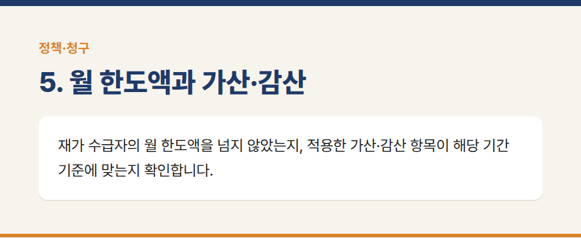
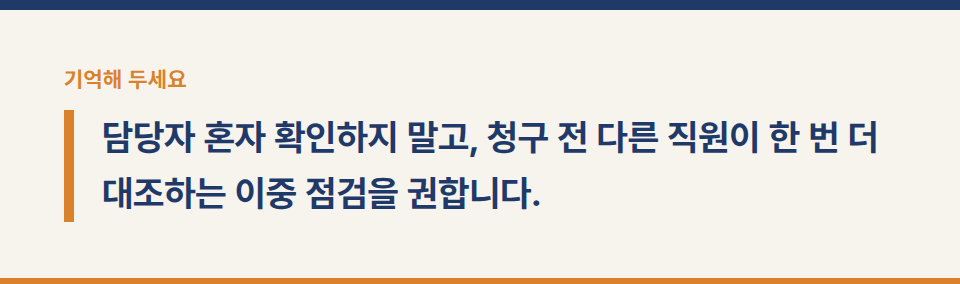
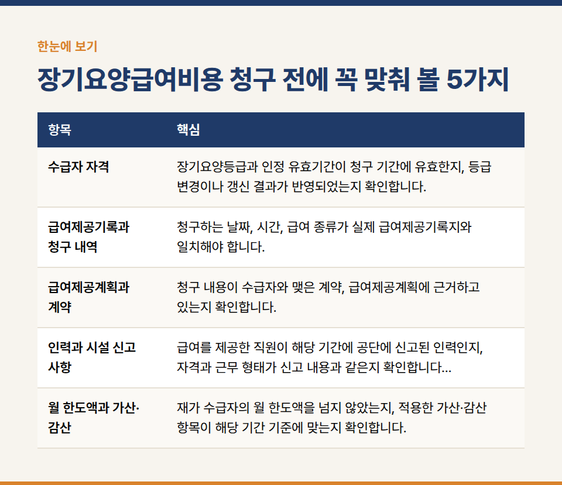

카테고리: 정책·청구
장기요양급여비용 청구 전에 꼭 맞춰 볼 5가지

청구 오류는 대부분 작은 불일치에서 시작됩니다. 매달 청구하기 전에 아래 다섯 가지를 맞춰 보는 습관을 들이면, 반송과 환수 위험을 크게 줄일 수 있습니다.

## 1. 수급자 자격

장기요양등급과 인정 유효기간이 청구 기간에 유효한지, 등급 변경이나 갱신 결과가 반영되었는지 확인합니다. 감경 자격 변경도 함께 봅니다.

## 2. 급여제공기록과 청구 내역

청구하는 날짜, 시간, 급여 종류가 실제 급여제공기록지와 일치해야 합니다. 방문급여는 전자 태그 등으로 남긴 시작·종료 기록과 청구 시간이 맞는지 대조합니다.

## 3. 급여제공계획과 계약

청구 내용이 수급자와 맺은 계약, 급여제공계획에 근거하고 있는지 확인합니다. 계획에 없는 서비스를 제공했다면 계획 변경과 설명 기록이 있어야 합니다.

## 4. 인력과 시설 신고 사항

급여를 제공한 직원이 해당 기간에 공단에 신고된 인력인지, 자격과 근무 형태가 신고 내용과 같은지 확인합니다. 퇴사·입사·근무시간 변경은 바로 변경 신고합니다.

## 5. 월 한도액과 가산·감산

재가 수급자의 월 한도액을 넘지 않았는지, 적용한 가산·감산 항목이 해당 기간 기준에 맞는지 확인합니다.

담당자 혼자 확인하지 말고, 청구 전 다른 직원이 한 번 더 대조하는 이중 점검을 권합니다.

※ 이 글은 실무 점검을 위한 일반 안내입니다. 구체적인 청구 기준은 보건복지부 고시와 국민건강보험공단의 청구 안내를 따라 주세요.

장기요양기관 평가·청구 실무 문의: 동행솔루션 042-673-3338 / donghangsol@naver.com
