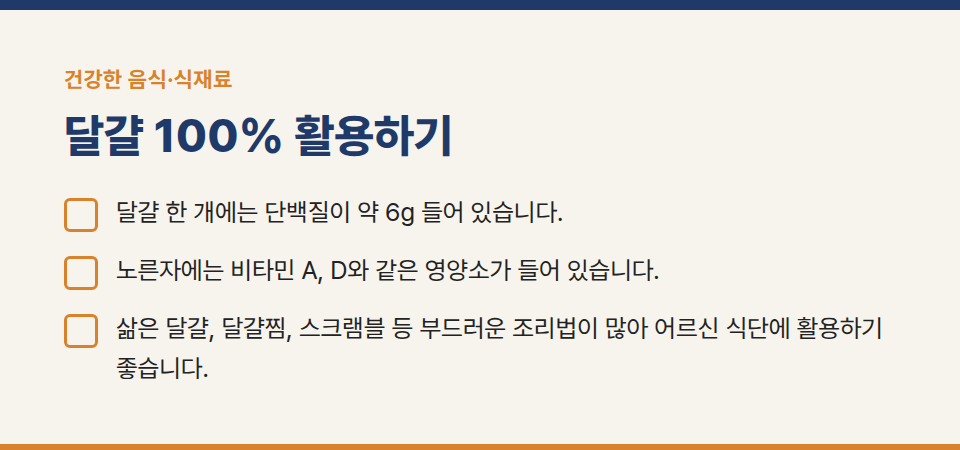
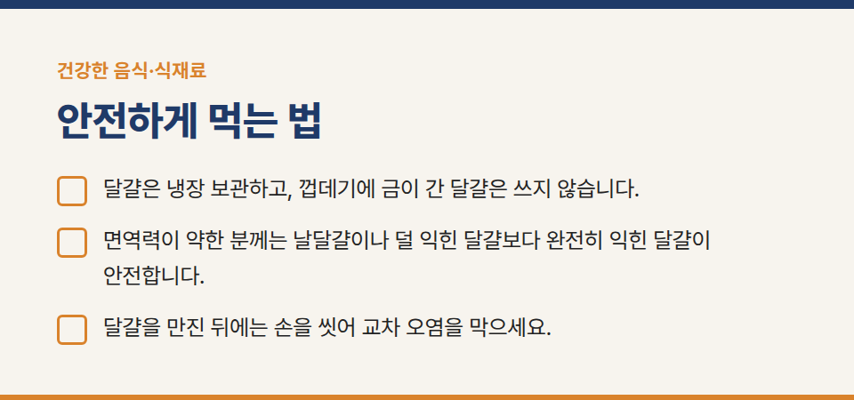
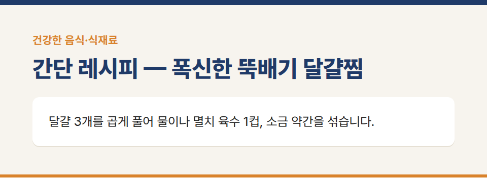
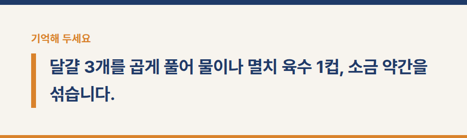
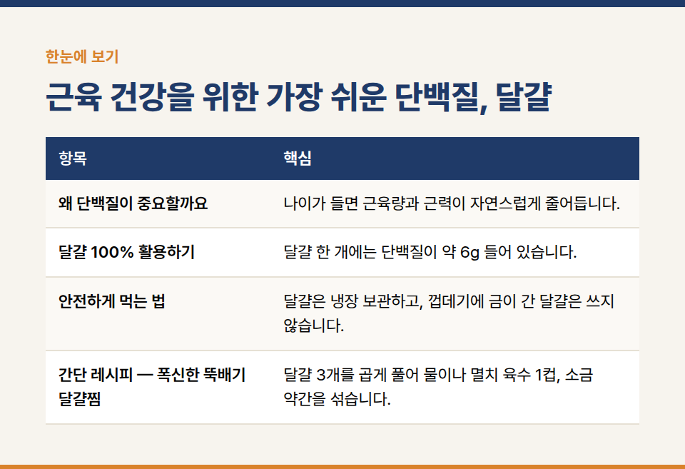

카테고리: 건강한 음식·식재료
근육 건강을 위한 가장 쉬운 단백질, 달걀

달걀은 구하기 쉽고 값이 부담 없으며 조리도 간단한 단백질 식품입니다. 필수아미노산이 고루 들어 있어 양질의 단백질로 꼽힙니다.

## 왜 단백질이 중요할까요

나이가 들면 근육량과 근력이 자연스럽게 줄어듭니다. 근육이 줄면 걷기, 일어서기 같은 일상 동작이 힘들어지고 낙상 위험도 커질 수 있습니다. 적절한 운동과 함께 매 끼니 단백질을 고르게 먹는 것이 도움이 됩니다.

## 달걀 100% 활용하기

- 달걀 한 개에는 단백질이 약 6g 들어 있습니다.
- 노른자에는 비타민 A, D와 같은 영양소가 들어 있습니다.
- 삶은 달걀, 달걀찜, 스크램블 등 부드러운 조리법이 많아 어르신 식단에 활용하기 좋습니다.

## 안전하게 먹는 법

- 달걀은 냉장 보관하고, 껍데기에 금이 간 달걀은 쓰지 않습니다.
- 면역력이 약한 분께는 날달걀이나 덜 익힌 달걀보다 완전히 익힌 달걀이 안전합니다.
- 달걀을 만진 뒤에는 손을 씻어 교차 오염을 막으세요.

## 간단 레시피 — 폭신한 뚝배기 달걀찜

달걀 3개를 곱게 풀어 물이나 멸치 육수 1컵, 소금 약간을 섞습니다. 뚝배기에 붓고 약불에서 저어 주다가 몽글해지면 뚜껑을 덮어 2~3분 더 익히고 송송 썬 쪽파를 올립니다.

※ 질환이 있거나 약을 복용 중이라면 식단을 바꾸기 전에 의사나 영양사와 상담해 주세요.
