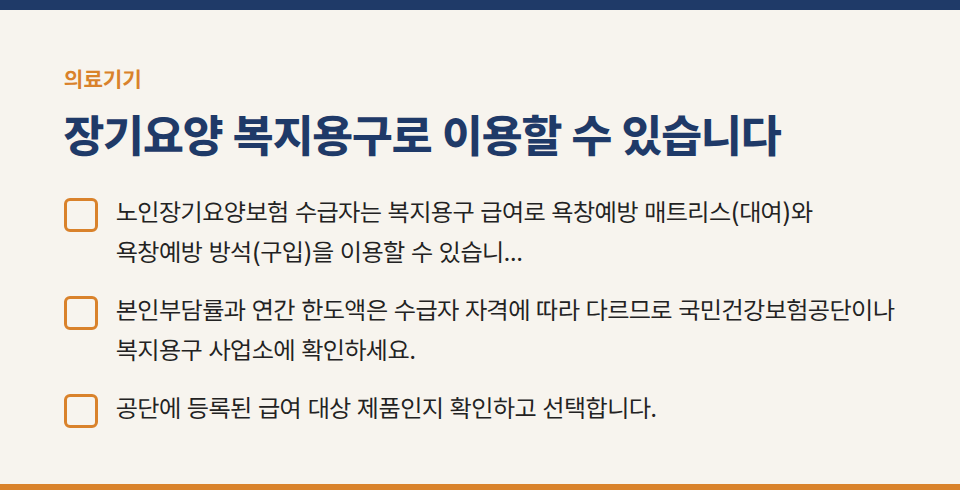
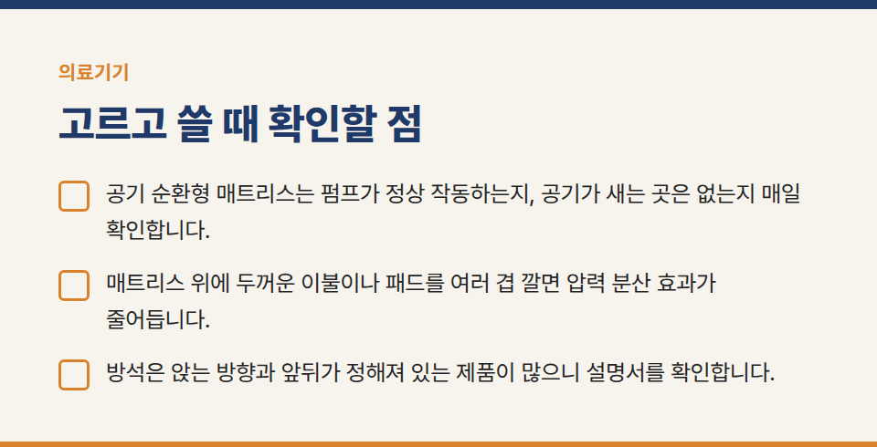
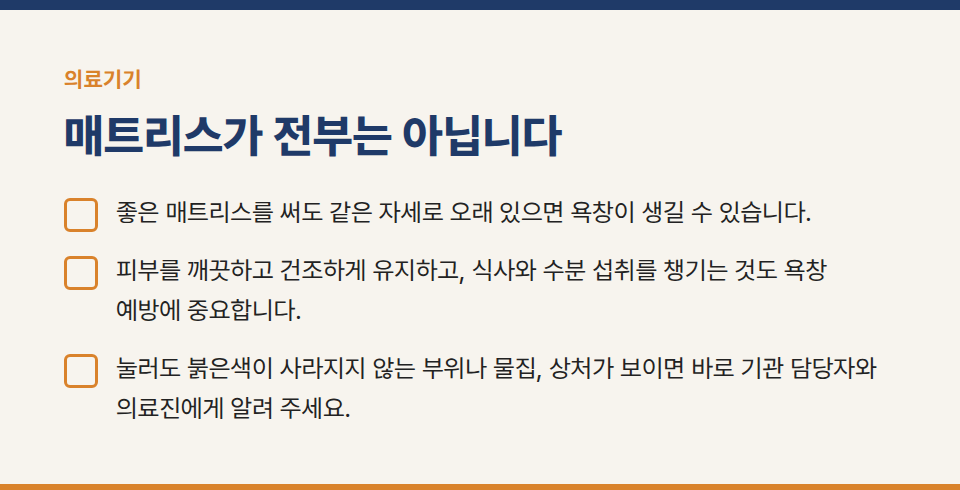
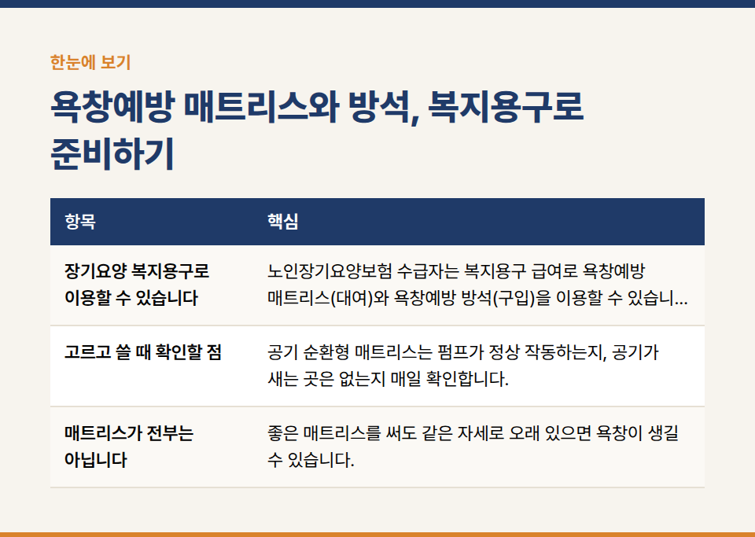
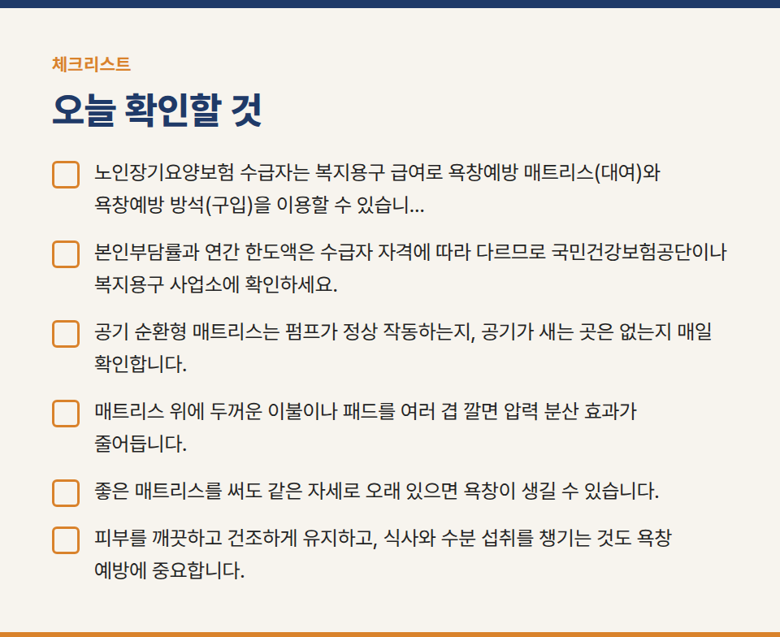

카테고리: 의료기기
욕창예방 매트리스와 방석, 복지용구로 준비하기

오랜 시간 누워 지내거나 앉아 지내는 분은 엉치뼈, 발뒤꿈치, 엉덩이처럼 뼈가 튀어나온 부위에 압력이 계속 가해져 욕창이 생기기 쉽습니다. 욕창예방 매트리스와 방석은 압력을 고르게 나누어 피부 부담을 줄이는 데 도움을 줍니다.

## 장기요양 복지용구로 이용할 수 있습니다

- 노인장기요양보험 수급자는 복지용구 급여로 욕창예방 매트리스(대여)와 욕창예방 방석(구입)을 이용할 수 있습니다.
- 본인부담률과 연간 한도액은 수급자 자격에 따라 다르므로 국민건강보험공단이나 복지용구 사업소에 확인하세요.
- 공단에 등록된 급여 대상 제품인지 확인하고 선택합니다.

## 고르고 쓸 때 확인할 점

- 공기 순환형 매트리스는 펌프가 정상 작동하는지, 공기가 새는 곳은 없는지 매일 확인합니다.
- 매트리스 위에 두꺼운 이불이나 패드를 여러 겹 깔면 압력 분산 효과가 줄어듭니다.
- 방석은 앉는 방향과 앞뒤가 정해져 있는 제품이 많으니 설명서를 확인합니다.

## 매트리스가 전부는 아닙니다

- 좋은 매트리스를 써도 같은 자세로 오래 있으면 욕창이 생길 수 있습니다. 정해진 간격으로 자세를 바꿔 드리고, 피부가 붉어진 곳이 없는지 매일 살핍니다.
- 피부를 깨끗하고 건조하게 유지하고, 식사와 수분 섭취를 챙기는 것도 욕창 예방에 중요합니다.
- 눌러도 붉은색이 사라지지 않는 부위나 물집, 상처가 보이면 바로 기관 담당자와 의료진에게 알려 주세요.

※ 이 글은 일반적인 사용 안내입니다. 제품별 사용법은 사용설명서를 따르고, 측정값이 평소와 다르거나 증상이 있으면 의료진과 상담해 주세요.
